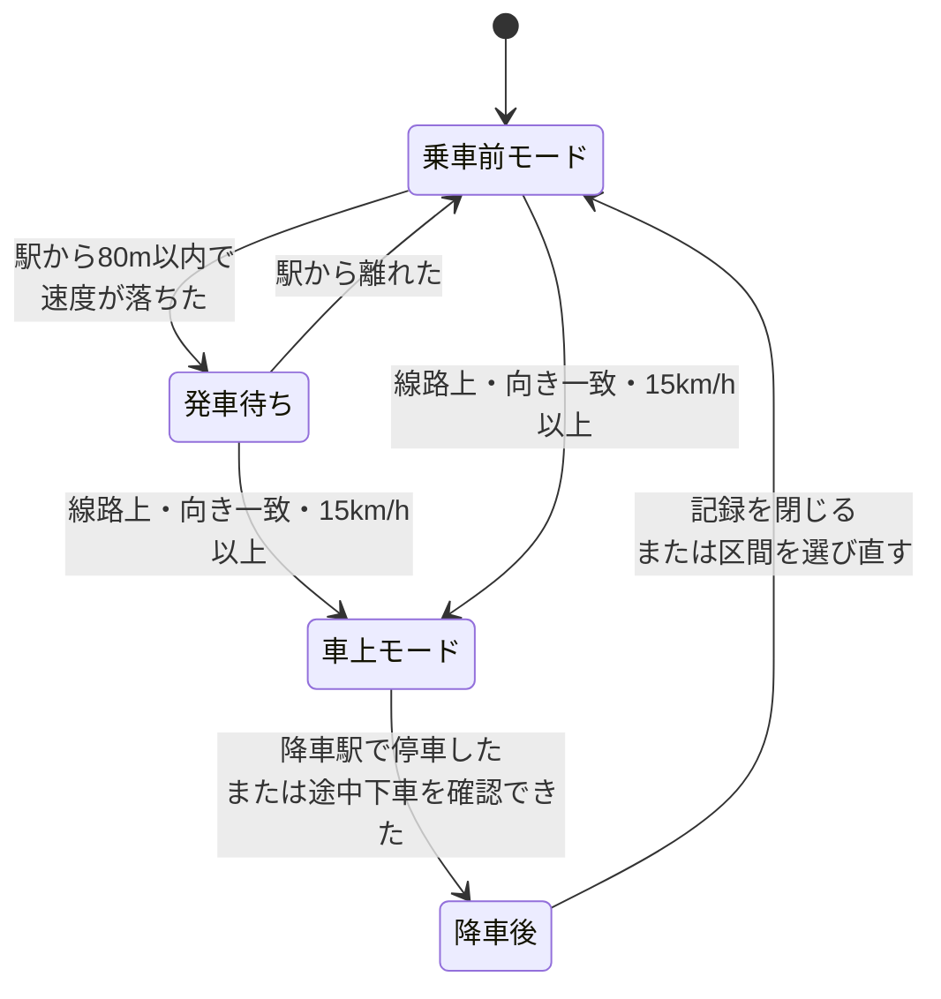
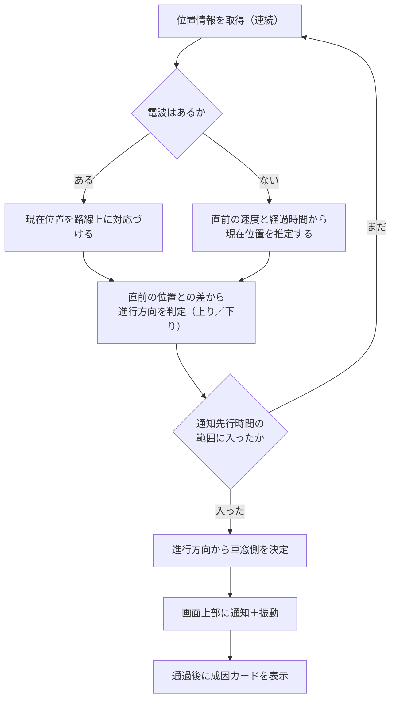
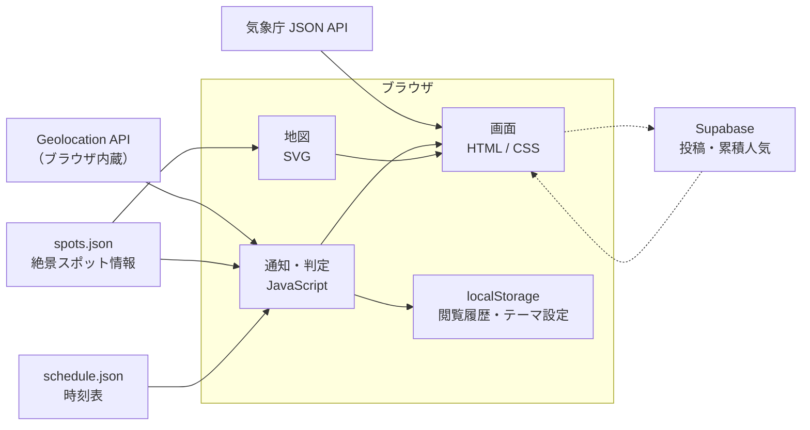

# 車窓絶景ナビ 設計書

銚子電鉄の車窓から見える絶景を、見逃さないためのウェブサイト。Geoアクティビティコンテスト応募作品。

用語の定義は [CONTEXT.md](../CONTEXT.md) を参照。今回作らないものは [将来構想.md](./将来構想.md) に分けてある。

---

## 1. 企画概要

乗客のスマートフォンに、絶景スポットの接近と、進行方向から見て左右どちらの窓かを表示する。通り過ぎたあとに、その風景ができた地理的な理由を数コマのマンガで見せる。

銚子から外川まで 19 分。窓の外を見張っていなくても見逃さない。

対象路線は銚子電鉄（銚子駅〜外川駅、全長 6.4km、10 駅）に限定する。表示言語は日本語のみ。

### 1.1 応募作品は 2 画面からなる

**この設計書が扱うのは車窓絶景ナビ（乗車中・スマートフォン）だけである。** 応募作品にはもう一つ、旅行前にパソコンで眺める **絶景掲示板** がある。

| | 車窓絶景ナビ | 絶景掲示板 |
|---|---|---|
| いつ | 乗っているあいだ | 旅行の前 |
| 端末 | スマートフォン | パソコン専用（狭い画面では案内ページだけ） |
| 範囲 | 銚子電鉄の沿線から見えるもの（6 件） | 銚子エリア全体（25 件。屏風ヶ浦・松岸など路線外も含む） |
| 地図 | SVG の平面イラスト（[ADR-0001](adr/0001-地図はタイルを使わず自作イラストとする.md)） | CSS 3D の斜め視点（[ADR-0005](adr/0005-絶景掲示板だけは斜め視点の立体地図にする.md)） |
| 入口 | `index.html` | `board.html` |
| データ | `data/choshi/spots.json` | `data/choshi/board-spots.json`・`data/choshi/board-posts.json` |
| 仕様書 | この文書 | [絶景掲示板_設計メモ.md](絶景掲示板_設計メモ.md) |

絶景掲示板の本体は `board.html`（2026-08-19 実装。生成物なので直すのは `tools/board-template.html`）。掲示スポット 25 件の内訳は、観光協会の公式写真がある 12 件と、車窓絶景ナビと同じ場所を指す 4 件（S01・S02・S03・S05）、それに現地調査の写真で足した 9 件（満願寺と、銚子・仲ノ町・観音・本銚子・笠上黒生・君ヶ浜・海鹿島・犬吠の 8 駅）である。後ろの 13 件は公式写真を持たないので、**乗客から届いた写真が 1 枚も無いあいだは地図にピンが出ない**（[設計メモ 2 章](絶景掲示板_設計メモ.md)）。駅が掲示スポットに入ったことで、地図の上で「駅の写真」と「景色の写真」が見分けにくくなったため、上バーで**駅／絶景**を絞り込めるようにしてある（[設計メモ 2・3 章](絶景掲示板_設計メモ.md)、[CONTEXT.md](../CONTEXT.md)）。**掲示スポットは「その写真を撮った場所」で決まる**ので、車窓絶景ナビの絶景スポット（その絶景が**見える区間**）とは一対一に対応しない。森のトンネル（S03）と本銚子駅が別項目なのはこのためである。仕様・決定の経緯・未決はすべて設計メモ側にあり、この設計書では繰り返さない。**両者は地形データと配色（5.2）と累積人気の仕組み、そして写真を送る処理（`js/photo-post.js`）を共有するが、それ以外のコードは共有しない。**

---

## 2. 課題と提供価値

### 課題

車窓から絶景を楽しもうとすると、次のことで困る。

**見える側がわからない。** 撮影しようと窓際で構えていたのに、実際には反対側の窓だった。同じ地点でも上りと下りで左右は逆になるため、事前に調べていても間違えやすい。

**いつ来るかわからない。** 見逃すまいと窓の外を見つめ続けるのは疲れる。気を抜くと過ぎている。

**なぜその風景なのかがわからない。** 見えたものが「きれいな畑」で終わってしまう。その畑がなぜそこに広がっているのかは、鉄道会社のサイトにも書かれていない。

### 提供価値

| 課題 | 提供するもの |
|---|---|
| 見える側がわからない | 進行方向を自動で判定し、左右どちらの窓かを通知する |
| いつ来るかわからない | 接近を先に知らせる。窓の外を見つめ続けなくてよい |
| なぜその風景なのかがわからない | 通過後に、その風景ができた地理的な理由を短いマンガで見せる |

3 つ目に力を入れる。銚子の台地は水に乏しく、稲作より畑作に向いた。だから車窓にキャベツ畑が広がる。このつながりを、その土地の味や手ざわりに置きかえて伝える。

---

## 3. 利用シナリオ

### 3.1 四つの局面

**乗車前。** 地図を開くと、路線と絶景スポットが出る。その日の天候に合う見どころに色がつく。興味のないテーマは消せる。

**発車待ち。** 駅に着くと、地図の上に発車待ちの帯が出る。次の発車時刻と、その日のおすすめの絶景、それが上り・下りそれぞれでどちら側の窓から見えるかを、乗る前に一目で確かめられる。座る側を決めてから乗れる。

**車上。** 電車が動き出すと車上モードに変わる。現在位置が地図上を進み、絶景スポットが近づくと画面上部に通知が出る。通知には残り時間と、左右どちらの窓かを書く。時刻表とずれていれば遅れも出す。

**降車後。** その日通過した絶景スポットの成因カードと、旅の記録をまとめて読める。

### 3.2 モードの自動判定

利用者に「駅に着きました」「乗りました」と申告させない。位置と速度だけで切り替える。

**発車待ちへ。** 駅の座標から半径 80m の内側に居て、歩く程度の速さまで落ちていれば発車待ちとする。半径を 80m まで広げるのは、市販の端末の位置情報が 5〜15m ずれ、駅前の建物のあいだではさらに悪くなるためで、10m ほどの円では駅に立っていても入れないことがある。駅どうしは数百 m 以上離れているので、広くしても取り違えはしない。駅前の道を通り過ぎるだけの人は、すぐ円から出るので消える。

**車上へ。** 次の三つがそろったときに切り替える。

| 条件 | 値 | なぜ |
|---|---|---|
| 線路からの距離 | 30m 以内 | 位置情報の誤差の 2 倍ほど。沿線の道路の多くはこれより離れている |
| 進行方向 | 線路の向きとおおむね一致 | 線路と並んで走る車を除くため |
| 速度 | 時速 15km 以上 | 歩く速さ（時速 10.8km）と分けるため |

**車上モードからは、停車では抜けない。線路から離れただけでも抜けない。** 抜けるのは次のいずれか。

| 抜ける条件 | 値 |
|---|---|
| 降りる駅に着いた | 乗車区間で決めた降車駅（未設定なら進んでいる向きの終点）の 80m 以内で、かつ停車した |
| 途中下車を確認できた | 降りる予定ではない駅の近く（80m 以内）で線路から離れていて、利用者が「降りた」と答えた |

**降りる駅は「路線の終点」ではなく「利用者が決めた降車駅」。** 仲ノ町から笠上黒生までのように途中で降りる人にとって、旅の終わりはそこであって外川ではない。乗車区間が未設定のときだけ、進んでいる向きの終点を使う。

途中の駅で降りると、乗ってきた電車はそのまま目の前を走り去っていく。この動きを「また乗った」と読んで車上モードへ戻ってしまうと、旅の記録の上に次のスポットの通知がかぶさる。そこで降車後に入ったら、旅の記録を閉じるか乗車区間を選び直すまで、車上モードへは戻さない。記録を閉じる操作は「いや、まだ乗っている」という合図として扱う。

速度を「入るとき」だけの条件にしているのは、電車が途中駅で必ず停まるため。速度で抜ける作りにすると、銚子から外川までの 8 つの途中駅すべてで車上モードが切れ、そのたびに通知も遅れの表示も止まってしまう。乗っている人は降りるまで乗っている。降りたかどうかは、駅の近くにいるかどうかで見分ける（次項）。

切り替えるときは画面上部に短い帯を出す。操作は妨げない。

#### 線路から離れただけでは降りたとみなさない（乗客のFB、2026-08-24）

以前は「線路から 30m の外に 15 秒続けて離れていたら降りた」とみなし、車上モードから乗車前モードへ自動で戻していた。ところが、GPS は場所によって精度が大きく崩れることがあり、実際に乗ったまま 30m・15 秒を超えてずれる例が報告された。そうなると車上モードが利用者の知らないうちに終わり、線路の上へ戻ってきても「まだ旅の途中」だと認識し直す手立てがなく、降車後の振り返り（旅の記録）が出ないまま、その日の記録ごと失われた。

**電車を降りられるのは、走っている途中ではなく駅に停まっているときだけ。** そこで「線路から離れているか」だけでは判定しない。**線路から離れている状態そのものは、乗ったままの GPS のぶれとして扱い、車上モードを保つ。** 現在位置の印がその間ぶれてもよい。

そのかわり、降りる予定ではない駅の近く（80m 以内）で線路から離れているときだけ、「◯◯駅で降りましたか？」と一度確認する。

- **「降りた」と答えた。** 乗った地点からその駅までを 1 回の乗車として、旅の記録（振り返り）を出す。途中下車として扱う。
- **「まだ乗っている」と答えた、または何もしない。** GPS のぶれとして扱い、車上モードのまま続ける。線路の上へ戻るまで、同じ駅について聞き直さない。線路の上へ戻れば、その答えも聞きかけの確認も忘れる（次にどこかの駅の近くで同じ状況になれば、改めて聞く）。



発車待ちを経ずに車上モードへ入る道も残す。位置情報を許可したのが乗ってからだった場合や、途中駅で判定を取りこぼした場合でも、通知だけは動く。

降車後へ移るとき、まだ通過扱いになっていない絶景スポットがあれば、まとめて通過扱いにする。外川駅と河津桜・菜の花はどちらも 6440m 地点にあり、停車位置とスポットが重なる。2 両編成は約 36m あるので、乗っている車両と位置情報の誤差しだいで、通過を検出できないことがある。取りこぼしても旅の記録には残す。

まとめて拾う範囲は、**乗った地点から降りる駅まで**に限る。乗る前に通り過ぎた区間や、降りたあとに電車が進んだ区間まで拾うと、見ていない景色が記録に並ぶ。

### 3.3 通知が出るまで



**進行方向の判定。** 位置情報は「いまどこにいるか」しか教えてくれない。連続する 2 点の差から移動の向きを求め、路線の向きと照らして上りか下りかを決める。左右どちらの窓かは、この判定で決まる。

**通知を出すとき。** 「そのスポットまでの残り距離 ÷ いまの速度」が 45 秒を切ったら出す。固定の距離にしないのは、銚子電鉄が駅ごとに加減速するため。同じ 200m でも、走り出したところと駅に近づいているところでは、着くまでの時間が倍ちがう。

**電波がない場合。** 位置情報が途切れたら、途切れる直前の速度と経過時間から現在位置を推定して通知を出す。ただし 60 秒まで。それを超えたら推定をやめ、通知と遅れの表示を引っこめる。全長 6.4km を 19 分で走る路線では、1 分ぶんの誤差はもう無視できない。位置情報が戻ったら再開する。

そのため、絶景スポットの情報・地図・アイコンは乗車前にまとめてブラウザへ保存しておく。通信が切れても通知は動く。止まるのは天候の取得だけ。

---

## 4. 画面構成

画面は 5 つ（**車窓絶景ナビの分。絶景掲示板の画面は 1.1 のとおり別立て**）。共通の白い半透明の枠組みの上に、テーマの色が透ける。ボタンの位置と操作方法は、画面が変わっても同じにする。揺れる車内で押し間違えないため。

### 4.1 地図画面（乗車前モード）

```
┌─────────────────────────────┐
│                             │  ← 上の帯は畳んである（ⓘ で出す）
│    ／￣￣＼    ◇本銚子      │  ← 地形は色の濃淡で表す
│   ／ 台地  ＼   │           │     アイコンはテーマ色の
│  ｜  ◇笠上黒生 │           │     ひし形バッジ
│   ＼      ／  ◇観音        │
│      ￣￣    │             │
│   ▓▓▓ 海 ▓▓▓ ◇仲ノ町    ⊕ │  ← 路線全体へ戻す（位置は固定）
│  ↑N ├──── 500m ────┤      │  ← 方位と縮尺（ここも固定）
├─────────────────────────────┤
│ きょうは晴れ。海がよく見えます │  ← 天候による強調（自動）
│  ◆   ◆   ◆   ◆         ⓘ │  ← テーマの絞り込み／出典を出す
└─────────────────────────────┘
```

最初は路線と絶景スポットのアイコンだけを出す。そこへ、その日の天候に合う見どころを足す。興味のないテーマは利用者が消せる。

#### 上の帯は畳んでおく

作品名・路線名・乗車区間・出典は、乗っているあいだずっと要る情報ではない。画面の上を占めつづけると、地図と接近の通知が使える高さを削る。

そこで **自動では一切出さない。** 開いたときも、区間を決めた直後も畳んだまま。出るのは下の帯の **ⓘ** を押したときだけで、5 秒たてばまた畳む。地図の何もないところを押しても畳む。「押したときだけ」の一つの決まりにしてあるので、いつ出るのか迷わない。

**ただし帰属の 1 行だけは、畳まずに地図の上へ常時出す**（2026-09-01）。方位と縮尺のすぐ上に、小さく `© OpenStreetMap contributors／国土地理院タイルを加工して作成` と置いてある。

畳めないのは、OpenStreetMap の[帰属ガイドライン](https://osmfoundation.org/wiki/Licence/Attribution_Guidelines)が **"attribution should not require individuals to interact with the map ... to see the attribution"**（押さないと出ない形にしてはいけない）としているため。ガイドラインは折りたたみ自体は認めているが、それは「最初に出してから 5 秒で畳む」等であって、最初から隠しておくことではない。以前は ⓘ→出典の中だけに置いていたが、それはこの条件を満たしていなかった。

「加工して作成」は地理院の[出典の記載](https://www.gsi.go.jp/LAW/2930-meizi.html)が求める表記で、**編集・加工したことを書くこと**、および編集・加工したものを地理院が作ったかのように見せないことを求めている。この作品は標高タイルを 6 段の段彩に変え、陰影起伏図を貼り合わせて縮めているので、どちらも「加工」にあたる。なお出典を書けば申請は要らない（標高タイル・陰影起伏図とも「出典の記載のみで利用可能なもの」）。

詳しい一覧のほうは、これまでどおり隠しきりにはしない（[ADR-0003](adr/0003-地形の陰影は自前で計算せず国土地理院の陰影起伏図を使う.md)）。どの画面からでも 1 手で辿れる場所に置く。

**一覧のうち時刻表と絶景スポットの解説は、路線ごとに出どころが違う。** 静的に書くと有楽町線を見ているのに銚子電鉄と出るので、`data/lines.json` の `credits` から入れている。路線を足すときは `credits` も書くこと。

#### 地図の上に浮かぶボタンは、画面が変わっても動かさない

地図の右端に縦へ積むのは「現在位置へ戻す」と「撮る」だけにする。三つ並ぶと、地図より先にボタンの列が目に入る。ⓘ をこの列に置かず、テーマの絞り込みと同じ段の空いている右側に寄せているのはそのため（帯の高さは増えない）。

**それぞれの置き場所は一つに決めて、二度と動かさない。**

| ボタン | 置き場所 | 出る画面 |
|---|---|---|
| 現在位置／路線全体へ戻す | 下の段 | すべて |
| 撮る | その一つ上 | 車上だけ |

戻すボタンを下の段にしているのは、乗車前は撮るボタンが無いためである。上の段に置くと、乗車前は下に空きができてボタンが宙に浮いて見える。下の段に置けば、乗車前は「右下に丸が一つ」という自然な形になり、車上ではその上に撮るボタンが増えるだけで済む。

置き場所は**画面の下端からの決まった距離**で決める。下の帯の高さに合わせていたころは、帯の中身（天候のひとこと・見どころ・車上の足もと）で高さが 78px〜128px と変わるので、画面が変わるたびにボタンが上下していた。方位と縮尺も同じ理由で固定する。

丸そのものは 38px にするが、**押せる範囲は 48px を保つ。** 揺れる車内で押し間違えない大きさは、見た目を小さくしても手放さない。

#### 方位と縮尺

自作のイラスト地図には、地理院地図のような目盛りがない。「次の絶景まであとどのくらいか」を目分量で掴めるように、地図の約束ごとだけを左下に置く。

北はつねに画面の上にあり、地図は回らない。だから方位の針も回さない。縮尺の帯は、10m・20m・50m… と切りのよい値のうち 96 画素に収まるいちばん大きなものを選び、帯の長さのほうで合わせる。「103m」のような端数は読む手間がかかるだけで、目分量の役に立たない。

#### テーマの絞り込みは絵だけにする

「地形」「気候と農業」「産業と水運」「海と空」と文字を横に並べると、押すためのボタンではなく読みものに見え、地図より先に目が行く。そこでテーマ名は出さず、テーマを表す絵（山・双葉・工場・雲と海）を地図のバッジと同じひし形に収めて並べる。

絵とテーマ名は、絶景スポットの下敷きと成因カードの見出しで結びつく。そこには同じ絵とテーマ名が並んで出る。

選んでいるテーマはひし形を塗り、選んでいないテーマは輪郭だけにする。絵しかない小さな的では、薄くするだけでは on / off が読み取れない。

天候の予報は「千葉県北東部」のような広い区分でしか手に入らない。そのため「この地点はよく見える」とは書かず、「きょうは晴れ」とだけ書く。

#### 拡大・縮小

指 2 本またはホイールで拡大、指 1 本で移動する。いちばん引いた状態が上の図（路線全体）で、そこから 16 倍まで寄れる。16 倍で、駅ひとつとその周り 300m ほどが画面いっぱいになる。関東全域のような広い範囲は出さない。この作品が答えるのは銚子電鉄の車窓についてだけで、それより広い地図は読む理由がない。

拡大しても、文字・駅の印・絶景スポットのアイコン・線路の太さは画面上の大きさを変えない。変わるのは地形の細かさと、それらの間隔だけ。寄るほど文字が大きくなる作りにすると、いちばん寄ったところで名前ひとつが画面を埋めてしまう。

絶景スポットの**名前**は、少し寄ってから出す。路線全体を見ているあいだはアイコンだけにして、地形と路線の形が読み取れる状態を保つ。

引いた状態へ戻すボタンを画面の右下に置く。乗車前モードでは位置情報を使わないので、これは「現在位置へ」ではなく「路線全体へ」戻すボタンとして働く（車上モードで本来の意味になる）。

#### 現在位置の印は、線路の上にいれば出す

車上モードでしか出していなかったころは、ホームで地図を動かすと自分がどこにいるのか分からなくなった。予習をしているときこそ「いま自分はここ」と「絶景はあそこ」の距離を掴みたい。位置情報が線路の上を指しているあいだは、乗る前でも降りたあとでも印を出す。

ただし**地図はそこへ寄せない。** 見ている人が決めた見え方を横取りしないため。寄せるのは車上モードの追従だけ。

乗る前は**進行方向の矢印を出さない。** ホームを歩いているあいだにも向きは付いてしまうが、それは乗る向きとは関係がない。まだ決まっていないことを、決まったように見せてしまう。

#### 絶景スポットの下敷き

アイコンを押すと、画面の下半分にそのスポットの下敷きが出る。**これは成因カード（6 章）ではない。** 成因カードは通過後に読むもので、ここで出すのは乗車前の予習に必要なことだけ。

| 出すもの | 理由 |
|---|---|
| 名前・場所・テーマ | どれを見ているかがわかるように |
| ひとこと（`summary`） | 何が見えるのかの手がかり |
| 車窓側（上り・下りの両方） | 乗車前はどちら向きに乗るかわからないので、両方書く |
| 見ごろの季節・見える時間 | 行く日と、身構える余裕があるかの目安 |

下敷きを出すと、地図はその地点を「下敷きに隠れていない範囲のまんなか」へ寄せる。**倍率は変えない。** 利用者が決めた見え方を横取りしないため。下へはらうか、地図の何もないところを押すと閉じる。

### 4.2 地図画面（発車待ち）

```
┌─────────────────────────────┐
│ ● 銚子駅                     │
│   次の発車 14:32 外川方面      │  ← 時刻表の予定
│          15:08 外川方面      │
├─────────────────────────────┤
│                             │
│   （地図は乗車前モードと同じ）  │
│                             │
│                             │
├─────────────────────────────┤
│ この先の見どころ               │
│ ◈ 遠くに見える海      左の窓  │  ← 乗る前に座る側を決められる
└─────────────────────────────┘
```

駅に着いてから乗るまでの数分は、乗客がいちばん自由に画面を見られる時間である。揺れもしないし、窓の外を気にしなくてよい。ここで「どちら側に座るか」を決めておけば、乗ってからの通知は確認になる。

**出すのは、いちばん近い 1 件だけ。** 3 件並べていたころは、どれを待てばいいのかが読み取れなかった。ここで要るのは「次に来るのはどれで、どちらの窓か」だけで、その先は乗ってから接近通知が順に教えてくれる。

一時は「600m 以内に続いているときだけ 2 行」という例外を置いていたが、やめた。行が増えたり減ったりすると下の帯の高さが変わり、その上に置いてある丸ボタンと方位・縮尺まで動く。画面が変わるたびにボタンの位置が変わるほうが、1 行で足りない不便より重い。**この欄が常に 1 行であることが、右端のボタンを固定できる根拠になっている。**

**1 スポットは 1 行に収める。** 印・名前・車窓側で読み切れる形にし、折り返さない。印は地図のバッジとまったく同じもの（テーマ色のひし形＋その絶景の絵）を使う。ホームで覚えた形が、そのまま地図の上で探す手がかりになる。

天気が味方するスポットには、印のふちを暖色にするだけにとどめる。以前は「今日はよく見えそう」と 2 行目に書いていたが、1 行で読み切れることに意味がある欄なので、言葉ではなく地図バッジと同じ見た目の合図に寄せる。

**車窓側は、乗車区間が決まっていれば片側だけを言う。** 区間から進行方向が定まるため。区間が未設定のときだけ、上り・下りの両方を書く。

**次の発車時刻は時刻表の予定として出す。** 実際に遅れているかどうかは、この画面では分からない。それを知るには、その列車にいま乗っている誰かの位置情報が要るが、この作品は利用者どうしをつなぐ仕組みを持たない（[将来構想 8](./将来構想.md)）。

そのため「あと 3 分」のような分単位のカウントダウンは出さない。秒が減っていく表示は、実際の運行を見ているという印象を与える。遅れていれば乗り遅れる。時刻だけを書いておけば、乗客は駅の発車標と見比べて自分で判断できる。

### 4.3 地図画面（車上モード）

```
┌─────────────────────────────┐
│ ▶ まもなく 森のトンネル       │  ← 通知帯
│   右の窓 ・ あと 30 秒        │     テーマ色で塗る
├─────────────────────────────┤
│                             │
│    ／￣￣＼    ◆本銚子      │
│   ／ 台地  ＼   ●←現在位置  │
│  ｜        ｜   │           │
│   ＼      ／  ◇観音    [📷] │  ← 撮影ボタン
│      ￣￣                ⊕ │  ← 乗車前と同じ場所のまま
│  ↑N ├── 200m ──┤          │
├─────────────────────────────┤
│ 外川方面（下り） 約2分遅れ 3/6 │
│  ◆   ◆   ◆   ◆         ⓘ │
└─────────────────────────────┘
```

地図は乗車前モードと同じものを使う。増えるのは通知帯、進行方向、遅れの表示、それに撮影ボタンだけ。**乗車前から出ているもの（現在位置の印・戻すボタン・方位と縮尺・テーマの絞り込み・ⓘ）は、一つも場所を変えない。** 乗車前に覚えた見方がそのまま通じる。

#### 地図の動き

現在位置を画面のまんなかに保ったまま、地図のほうが流れる。指で動かすと追うのをやめ、右下のボタンを押すと現在位置へ戻って再び追いはじめる。地図アプリで見慣れた振る舞いにしておく。揺れる車内で、覚え直しをさせないため。

**追いかけているあいだ、そのボタンは薄くする。** 追っているときに押しても何も起きないので、control としては眠っている。地図を動かして追従が外れると、はっきり出てくる。押せば戻る、という合図になる。

引っこめてしまわないのは、置き場所を動かさないため（4.1）。このボタンは右端の下の段に居つづける約束なので、消すと上の撮影ボタンだけが残って下に穴が空く。伝えるのは濃さだけにする。

車上モードに入るときに一度だけ、路線全体（1 倍）から約 4 倍まで寄せる。1 倍のままだと 6.4km 全体が画面に収まっているので、現在位置の印が動くだけで、次のスポットがどちら側なのかが読み取れない。寄せるのはこの一度きりで、そのあとは利用者の操作を優先する。

#### 通知帯

| 段階 | 出るもの |
|---|---|
| 残り 45 秒を切った | 「まもなく ○○ ／ 右の窓 ・ あと 45 秒」＋ 振動 |
| そこから | 秒数を **5 秒刻み**で更新（45 → 40 → … → 15） |
| 残り **100m** を切った | 「**右側の車窓を見てください**」に変わる |
| 停車しているあいだ | 秒数を消し「まもなく ○○」だけ |
| 通過した | 帯が消える |

**秒数を 5 秒刻みにするのは、1 秒ずつ減る数字が気を散らすため。** 見てほしいのは数字ではなく窓の外で、必要なのは「まだ余裕がある／もうすぐだ」という感覚だけ。

**切り替えを距離（100m）で決めているのは、速度で決めると壊れるため。** 森のトンネルは本銚子駅と同じ 1863m 地点、河津桜・菜の花は外川駅と同じ 6440m 地点にある。電車はそこへ向かって減速して停まるので、距離と速度が同時に小さくなり、「残り距離 ÷ 速度」の答えが減らなくなる。停まれば速度は 0 になり、割り算そのものが成り立たない。距離なら、速度がいくつでも同じように効く。

**同時に二つは出さない。** 前のスポットを通過するまで、次の通知は待たせる。遠くに見える海（1496m）と森のトンネル（1863m）は 367m しか離れておらず、速い区間では二つの通知の時間が重なる。二つ並べると、揺れる車内では読みきれない。

**ただし、成因カードを一本化したスポットどうし（8.2、`spot.mergedWith`）だけは例外にした**（FB 2026-08-18）。相方も予告の範囲に入っていれば、通知帯を上下に重ねて出す（`js/main.js` の `showNotice` が 2 枚目を受け取れるようにしてある）。同じ一つの成因カードへつながる二つの景色なので、ここは「次はどっち」と迷わせるより、両方見せて心づもりしてもらうほうに倒した。ふつうのスポット（相方の無いもの）はこれまでどおり一つだけ。

通知帯は元々テーマ色の塗りつぶしで `backdrop-filter` を持たない（すりガラスではない。5.5 の「装飾を落とす」対象からも外れている）。二枚目を重ねても、増えるのは短い文字二行ぶんの描画だけで、スマートフォンでの負荷は無視できる大きさ（ぼかしを伴う要素を増やしたときのような影響はない）。

**振動は短く 1 回**（200ms ほど）。電車自体が揺れているので、長い振動や複雑なパターンは他の揺れと区別がつかない。なお iOS の Safari は振動に対応していないため、iPhone では鳴らない。通知の帯だけで用が足りるようにしておく。

#### ロック中も届く通知（任意）

画面内の帯と振動は、乗車中は画面を開いている前提で足りるとしていたが、画面を見ていない・ロックしている瞬間にも気づけるようにしてほしいという要望を受けて足した。**任意**（既定はオフ）で、「どこからどこまで乗りますか？」の画面に「ロック中もスマホに通知する」のチェックを置く。チェックして「決定」を押した端末でだけ、ブラウザの通知の許可を求める。

出す内容は通知帯と同じ文面（「まもなく ○○／右の窓」）で、出すタイミング・1 スポットに一度きりという回数も、通知帯・振動とそろえる。裏で動くのは蓄える係（[`sw.js`](../sw.js)）が持つ `showNotification` で、サーバーからの push ではない。**電車まで来なくてよい。乗る前に一度開いて許可しておけば、あとはこの端末の中だけで完結する**（9.1）。

対応する端末は限られる。Android の Chrome 等は、ブラウザのタブのままで届く。**iPhone の Safari は、ホーム画面に追加しないと Notification API 自体が無い**。追加した場合でも、ロック中に正確な秒数で発火するかは OS の判断に委ねられ、確実ではない。対応していない端末では、チェックの行ごと出さない（動かないなら黙って隠す、9.3）。一度「許可しない」を選んだ端末にも、同じ理由で出し直さない。

#### 遅れの表示

自分の位置情報と時刻表を照らして、いま乗っている列車が予定からどれだけずれているかを出す。他の利用者の位置は使わない。自分の端末の中だけで完結するので、通信を伴わない。

どの列車に乗っているかは、現在時刻と進行方向から時刻表を引いて自動で決める。利用者に選ばせない（3.2 と同じ考え方）。

予定どおりなら何も出さない。1 分以上ずれたときだけ「約 2 分遅れ」と書く。分より細かくは書かない。停車時間や発車の手際で数十秒は動くもので、それを秒で見せても正確になるわけではない。

**更新は 30 秒ごと。** 位置情報には常に 5〜15m の誤差があり、時速 30km なら 1〜2 秒ぶんの「遅れ」が絶えず揺れる。毎秒引き直すと、59 秒と 61 秒のあいだを行き来して表示が出たり消えたりする。

この表示は乗り継ぎのためにある。外川で折り返す時間、銚子で JR に乗り換える時間が足りるかどうかは、遅れが分かっていないと読めない。

#### 画面を眠らせない

車上モードのあいだは、画面が自動で暗くならないようにする（Screen Wake Lock）。多くの端末は 30 秒から 1 分ほど触らないと画面を消すが、この作品は「窓の外を見張らなくてよい」ことを value にしている。手を触れずに待っているあいだに画面が消えては、通知そのものが届かない。

車上モードを抜けたら解除し、ふだんのスマートフォンに戻す。

### 4.4 成因カード

絶景スポットを通過したあとに表示する。詳細は 6 章。

### 4.5 旅の記録

降車後に読める。詳細は 7 章。

---

## 5. 地図の設計

### 5.1 方針

路線・駅・絶景スポットの座標と標高には実データを使う。画面に出す絵は地図タイルではなく、ゲームの世界地図のようなイラストとして描き起こす。理由は [ADR-0001](./adr/0001-地図はタイルを使わず自作イラストとする.md) を参照。

乗客が知りたいのは、絶景スポットの位置と、この先が高いか低いか、路線全体の地勢。測量の精度はいらない。

### 5.2 地形の表現

標高データは色の濃淡に変換して背景に敷く。台地は濃く、低地は淡く、水域は青。等高線も数値も出さない。

その上に、国土地理院の**陰影起伏図**を重ねて立体感を出す。色の濃淡だけだと段彩図のように平たく見え、台地の縁がどこかが読み取りにくいため。陰影を自前で計算せず出来合いのタイルを使う理由は [ADR-0003](./adr/0003-地形の陰影は自前で計算せず国土地理院の陰影起伏図を使う.md) を参照。画像なので拡大すると必ずぼやける。約 6 倍から薄れさせ、10 倍で消す。そこから先は色分けと SVG の線だけが残る。

配信するのは **WebP**（241KB）。同じ絵が PNG では 1,447KB あり、これ 1 枚が初回読み込みの 84% を占めていた。駅でモバイル回線で開く作品なので、ここを削るのがいちばん効く。不透明度 0.85 で重ねる背景の陰影なので、劣化は目に見えない。生成の手順は [README](../README.md) を参照。

さらに、陸のかたちが海へ落とす影を敷いて、陸を一段高く見せる。海と陸の境目は地図の中でいちばん大きな段差なので、そこがはっきりしていると全体が立体に見える。

銚子電鉄は低地の銚子駅を出て台地に上がり、外川駅へ下る。本銚子駅の森のトンネルは台地を切り通した跡で、キャベツ畑が広がるのは台地に水が乏しいからだ。地図で起伏が読めるようにしておくと、成因カードの説明が入りやすい。

### 5.3 絶景スポットのアイコン

ひし形のバッジとして地図上に置く。中の絵はその絶景を表す（キャベツ、トンネル、波、醤油樽など）。色はテーマに従う。

### 5.4 テーマ配色

| テーマ | 地の色 | 差し色 | 淡色 | 対象 |
|---|---|---|---|---|
| 地形 | `#3F5A2E` | `#8A6F3E` | `#DCE5C8` | 切通し、台地の起伏 |
| 気候と農業 | `#6F8F36` | `#D99A2B` | `#F5EFD9` | キャベツ畑、ひまわり畑、桜 |
| 産業と水運 | `#2E4A6B` | `#B8A88A` | `#E8E4D8` | ヤマサ醤油工場 |
| 海と空 | `#2A6E8F` | `#7FC4D9` | `#E3F0F5` | 海が見える区間 |

この 4 色は地図のアイコン、通知帯、成因カード、旅の記録で共通に使う。色を見ればテーマがわかるようにしておく。

### 5.5 動かしているあいだは、装飾を落とす

この地図でいちばん描くのに費用がかかるのは、次の 3 つ。

| もの | なぜ重いか |
|---|---|
| 枠組みのすりガラス（`backdrop-filter: blur(14px)`） | 画面に 10 か所ある。後ろの地図が動くたび、10 か所ぜんぶをぼかし直す |
| 陸が海に落とす影（SVG の `feGaussianBlur`） | 海岸線という長い図形をまるごとぼかし直す |
| 陰影起伏図のなめらかな拡大縮小 | 1410×2074 の絵を、動くたびに補間し直す |

どれも「止まっているときの見え方」のためのもので、指を動かしている最中にそれを読んでいる人はいない。**指を置いているあいだだけ落とし、離したら戻す。** 止まっている画面の見た目は変わらない。ぼかしが消えるぶん枠組みの地色を濃くして（不透明度 0.82 → 0.93）、文字の読みやすさは保つ。

あわせて、**倍率が変わっていないときは作り直しをしない。** 「画面上の大きさを変えないための作り直し」（文字・印・線の太さ・影のぼかし幅・縮尺の帯）はどれも倍率だけで決まる。地図をただ動かしているだけのときは、やり直す理由がない。実測で 1 フレームあたりの処理が 0.43ms → 0.23ms になった。パンは指で触るいちばん多い操作なので、ここが効く。

---

## 6. 成因カードの設計

### 6.1 形式

数コマを順にめくって読む。案内役のキャラクターは置かず、その土地の側から語る文体で書く。

**1 スポットあたり 400 字ほどを、5〜6 コマに分ける。** 1 コマは 60〜80 字（3〜4 行）と、画像 1 枚。画像は任意で、無いコマがあってもよい。

コマ数を増やして 1 コマを短く保つのは、揺れる車内で読むため。1 コマが画面の半分を埋めるほど長いと、指で押さえながら目で追うことになる。

### 6.2 表示するタイミング

絶景スポットを**通過したあと**に出す。接近の通知には知識を載せない。

通知を見た乗客が知りたいのは「右の窓、あと 30 秒」だけだ。そこへ解説を足すと、撮影に間に合わせることも、知識を伝えることも中途半端になる。まず風景を見て、席に落ち着いてから読む。

**通過したら自動でせり出す。** 下へはらえば閉じられるので、見たくなければすぐに退けられる。あとから読み直したくなったら、地図上のバッジを押せばまた開く。通過したバッジは見た目を変えて、読めるものだと分かるようにしておく。

乗車前モードでアイコンを押すと出る下敷き（4.1）は、これとは別のもの。あちらは「どちら側の窓を見ればいいか」を答えるための予習用で、成因カードの中身は載せない。通過したあとは、同じバッジが成因カードを開くようになる。

#### 画像の扱い

**画像は自分たちで撮る・描くものだけを使う。** 鉄道会社や他所のサイトの画像は、許諾の確認が要るうえ、応募作品は公序良俗・関係法令（著作権等）に抵触すると選考対象外になる。プレゼン動画と作品予稿はコンテストのサイトに掲載され、会場でも上映される。自分たちで撮ったものなら、そのまま展示にも動画にも使える。現地検証（[将来構想 6](./将来構想.md)）に行くとき、あわせて撮ってくる。

**画像は発車待ちのあいだにまとめて先読みする。** 6 スポット × 5〜6 コマで 30 枚ほどになり、通過するそのときに読みはじめたのでは間に合わない。駅にいるあいだは電波がある見込みが高く、発車まで数分ある。先読みが間に合わなかったコマ、通信が無いときのコマは、文だけを出す。通知そのものは画像に依存しないので、いずれにせよ動く。

### 6.3 書き方

地理の授業にはしない。地形や気候の話を、味や手ざわりに着地させる。笠上黒生駅〜西海鹿島駅のキャベツ畑で書いてみる。

> **1コマ目**（台地と海風のイラスト）
> 水はけの良い台地と、暖かな海風。
> 稲より **畑作** に向いた土地が、ここに広がっている。
>
> **2コマ目**（キャベツのイラスト）
> だからキャベツは **甘く、パリッと** 育つ。
> 一口かじれば、潮風の余韻がのこる。

「台地は水利が悪く畑作に向く」という事実は落とさず、最後を味の話にしている。覚えてもらう必要はない。なお、特定の店への誘導はしない（[将来構想 3](./将来構想.md) 参照）。

### 6.4 参考

配色とレイアウトの示意図: [成因カード モックアップ](https://claude.ai/code/artifact/21fafd6c-9ad1-41cb-b4c5-451b603d0510)

---

## 7. 旅の記録

降車後に、その日の乗車をまとめて見せる。

```
┌─────────────────────────────┐
│ きょうの旅         3月20日(木) │
├─────────────────────────────┤
│ 銚子 ─◆─◆─◇─◆─◇─ 外川      │  ① 路線のタイムライン
│      産 海 地 気 気           │     通過したスポットを
│                             │     テーマ色で並べる
├─────────────────────────────┤
│ ◆ 森のトンネル               │  ④ 乗客が書いたひとこと
│    思ったより暗くて驚いた      │     押すと書き足せる・直せる
│ ◆ キャベツ畑                 │
│    ひとことを書く             │
├─────────────────────────────┤
│  ┌───┐ ┌───┐ ┌───┐          │  ② 撮った写真と
│  │   │ │   │ │   │          │     成因カードの抜粋
│  └───┘ └───┘ └───┘          │     写真ごとに一言を添えられる
│  海が光った                   │
├─────────────────────────────┤
│ 台地の風が、この土地の甘さを   │  ③ 体験としての結び
│ つくっていた。                │     押すと自分の言葉に変えられる
├─────────────────────────────┤
│        (◎)     (✕)          │  ⑤ SNS へ共有（任意、対応端末のみ）
│      [ 画像として保存 ]        │
│      [ 絶景掲示板に出す ]     │  ④ 投稿（ADR-0004）
└─────────────────────────────┘
```

**① 路線のタイムライン。** その日通過した絶景スポットをテーマ色の並びとして示す。何を見たかが一目でわかる。

**② 共有用の画像。** タイムライン、成因カードの抜粋、乗客が撮った写真を 1 枚の縦長画像にまとめ、保存できるようにする。乗客が SNS に上げれば、そのまま銚子電鉄の宣伝になる。

**⑤ SNS へ共有（FB 2026-08-18 で追加）。** ②の画像を Instagram・X へその場で渡せるようにしてほしいという指摘を受けた。ただしウェブから画像つきで直接投稿する公式な手段は、Instagram にも X にも無い（ログインとアプリ連携が要り、ADR-0004「ログインは持たない」と衝突する）。そこで端末の共有シート（Web Share API）を呼ぶ形にした。Instagram のアイコンから押しても X のアイコンから押しても、開くのは OS がまとめて出す同じ共有先の一覧で、そこから利用者に選んでもらう。1 タップでの自動投稿ではないが、いまウェブから作れる範囲でいちばん「そのまま」に近い。

対応するのは主に近年のスマートフォンのブラウザで、パソコンの多くは対応しない。ロック中通知（4.3）と同じ考え方で、**対応しない端末では行ごと出さない**（動かないなら黙って隠す、9.3）。呼べたが失敗した・対応する App が無いなど共有シート側で処理できなかった場合も、いつもの「画像として保存」と同じ手段に静かに切り替える。

**③ 結びの言葉。** 「今日学んだこと」の箇条書きにはしない。その日たどったつながりを、一文の感想として書く。その日いちばん多く通ったテーマに応じた一文を選ぶ。文そのものは `spots.json` と同じく人が手で書くファイルに置き、コードには埋めない。**この一文は書き換えられる**（7.2）。選ばれた文は「最初に入っている文」であって、乗客の言葉を決めるものではない。

### 7.1 写真

車上モードの画面に撮影ボタンを置く。押すと端末のカメラがそのまま立ち上がる（アプリの中にカメラの画面を作らない）。ブラウザが描くカメラは起動が遅く、シャッターも切りにくい。ふだん使っているカメラをそのまま開くほうが、一瞬で過ぎる森のトンネルにも間に合う。

撮った写真は、撮った時刻と、そのとき直近だった絶景スポットを一緒に覚えておく。旅の記録のタイムラインに、どこで撮ったものかを並べられるようにするため。

カメラから戻ってきたところで、**一言を添えるかどうかを聞く**（7.2）。書かずに閉じてもよく、あとから旅の記録でも書ける。

**写真は端末の中（IndexedDB）に残す。** あとから旅の記録を見返せるようにするため。`localStorage` に入れないのは、上限が 5MB ほどしかなく、写真 1 枚を文字列にしただけで埋まってしまうため。

写真を持つことで、この作品は**個人情報を扱うことになる**（顔が写り、写真には撮影地点の情報が含まれる）。

**車上モードで撮った写真は、端末の外へ出ない。** IndexedDB に入れたまま、旅の記録を組み立てるのにも共有画像を描くのにも端末の中だけで足りる。自動で送る先はどこにもない。

外へ出るのは、利用者が**「絶景掲示板に出す」を押したときだけ**である（[ADR-0004](./adr/0004-投稿と集計のためにサーバーを持ち、ログインは持たない.md)）。押すと、その日の写真から出すものを選び、同意 4 点に印を付ける画面を通る。そこを通らないかぎり、写真は端末に留まる。**この境界は実装でも守る**——IndexedDB から外へ読み出すのは `js/photo-post.js` の送信だけにし、他のどこからも送らない。

入口は旅の記録の共有の並びだけに置く。**成因カードにも、撮った直後にも出さない。** 撮ったその場で「出しますか」と聞くのは、顔が写っていないかを確かめる間もなく押させることになる。旅の終わりに、一度だけ聞く。

送るときは端末側で EXIF を落とす。どの絶景スポットの近くで撮ったかは上のとおり別に記録してあるので、落としても失われる情報はない。

### 7.2 乗客が書く言葉

**絶景を見て、写真ではなく文字で残したい人がいる。** 車窓から見たものを撮る人ばかりではないし、撮ったとしても、そのとき思ったことは写真には写らない。そこで、書く場所を三つ用意する。どれも**書きたければ書く**もので、書かなくても記録は成り立つ。

| どこで | いつ | 上限 |
|---|---|---|
| 写真に添える一言 | 撮ってカメラから戻った直後 | 15字 |
| 絶景ごとのひとこと | 通過したあと、成因カードの記章を押して | 60字 |
| その日の結び | 旅の記録で、結びの一文を押して | なし |

**字数は場所ごとに変える。** 写真の一言が短いのは、共有画像で写真 1 枚の下に 1 行で収めるため。絶景ごとのひとことは、旅の記録に何件も並べても読み通せる長さにする。**結びの一文だけは上限を持たない**——そこは「その日の感想」を書く場所で、字数で切ると、書きたいことのほうが削られる。長くなったぶんは入力欄と旅の記録の両方でスクロールする。

**結びの一文は、選ばれた文が最初から入った状態で開く。** 白紙から書かせない。旅のあとで「何を書けばいいか」を考えるのは、それだけで手が止まる。テーマから選ばれた一文（7 ③）を書き出しにして、気に入らなければ全部消して書き直せばよい。

**書いたものはすべて、旅の記録の側から直せる。** 揺れる車内で書ききれなくても、降りてから書き足せる。書いた文字は共有画像にも載る。

#### 記章を押して書く

絶景ごとのひとことの入口は、成因カードの右上にある**累積人気の記章**（[ADR-0004](./adr/0004-投稿と集計のためにサーバーを持ち、ログインは持たない.md)）にした。通り過ぎた絶景に「スタンプを押す」感覚に合わせている。書いたあとは記章に小さな印が付く。

ただし**記章はいつも出るわけではない**。サーバーに届いていて、かつその絶景が 5 回以上読まれているときにしか出ない。電波の弱い区間や、公開直後・現地展示の時点では出ないほうが普通である。だから**ここを唯一の入口にしない**。旅の記録には通過した絶景が全件並び、記章が出なかった絶景にもそこから書ける。

#### 書いたものの行き先

書いたものは端末の中に残る。通過の記録と同じ場所（`localStorage`）に、その絶景の記録と同じ行として持つ。写真に添えた一言だけは、写真と離れないよう写真と同じ場所（IndexedDB）に置く。

**書いた文字は、端末から出ない**（2026-08-19 の決定。[ADR-0004 の追記](./adr/0004-投稿と集計のためにサーバーを持ち、ログインは持たない.md)）。絶景掲示板に出るのは写真だけで、ひとことも結びの一文も、この端末と旅の記録の中だけに残る。共有画像に載せて自分で SNS へ上げることはできる——それは利用者自身が選んで行う操作である。

もともとは文字のほうを送る作りにしてあり、その仕組み（`submit_notes`）は消していない。掲示板に置き場のあるものが写真だったので、送る中身を入れ替えた。

---

## 8. データ設計

絶景スポットの情報は `spots.json` に置き、コードから完全に分離する。内容の追加・修正にプログラミングの知識を要さない。

人が手で書くファイルは `data/choshi/spots.json`・`data/choshi/schedule.json`・`data/lines.json`、そして絶景掲示板の `data/choshi/board-spots.json` の 4 つだけで、`data/` のそれ以外は `tools/` が作る。**`board-spots.json` は 1.1 の別画面のもので、項目も用途もこの章とは別である**（座標に出どころ `source` と確からしさ `confidence` を 1 件ずつ持つ。項目は[設計メモ 2 章](絶景掲示板_設計メモ.md)）。キャベツ畑・外川駅のように両方に出てくる場所があるので、片方の座標を直したらもう片方も確かめること（[ADR-0005](adr/0005-絶景掲示板だけは斜め視点の立体地図にする.md)）。

### 8.1 絶景スポットの項目

| 項目 | 意味 | 例 |
|---|---|---|
| `id` | 識別子 | `S03` |
| `name` | 表示名 | `森のトンネル` |
| `location` | 場所の説明 | `本銚子駅` |
| `theme` | テーマ | `地形` |
| `lat` / `lon` | 緯度・経度 | 要調査 |
| `sideUp` | 上り（銚子方面）で見える側 | `左` / `右` / `両` / `地下` |
| `sideDown` | 下り（外川方面）で見える側 | `左` / `右` / `両` / `地下` |
| `kind` | 車窓に見えるか（省略時は `scenery`） | `scenery` / `trivia` |
| `duration` | 景観継続時間 | `長` / `中` / `短` |
| `season` | 見ごろの季節 | `春` |
| `panels` | 成因カードのコマ | 配列（5〜6 コマ） |

`panels` の 1 コマは次の形にする。`image` は任意で、無ければ文だけのコマになる。

```json
{ "text": "水はけの良い台地と、暖かな海風。稲より畑作に向いた土地が、ここに広がっている。",
  "image": "images/S04-1.jpg" }
```

**段落を分けるときは、原則として新しいコマにする**（スワイプで送る次の画面になる）。同じコマの中でだけ改行したいとき（スワイプさせるほどでもない区切り）は、`text` の中に `\n` を書けばそのコマの中で改行される（`css/style.css` の `.origin-text` に `white-space: pre-line` を指定してあるため）。HTML タグは使えない（`textContent` で差し込むだけなので安全だが、太字などの装飾もできない）。

`sideUp` と `sideDown` は必ず両方持つ。同じ地点でも進行方向が逆であれば左右は反転するため、片方だけでは通知が作れない。両方が `地下` のスポットは、車窓には出ない「足もとの地理」（CONTEXT.md）として扱う（js/main.js の `isUnderground`）。

`kind` は、事前の通知（帯・振動・ロック中通知）を出すかどうかを分ける。`trivia`（見えない・見せられない雑学）は通知を出さない。近づいても急かさないという意味で、通り過ぎれば成因カードはふつうに開く（js/onboard.js の `noticeFor`）。地下のスポットは基本的に `trivia` になるが、両者は別の軸（`sideUp`/`sideDown` は見え方、`kind` は通知の要不要）なので、まとめて判定しない。省略したスポットは `scenery` として扱う。

`duration` は現時点では通知に使わない（通知先行時間は全線一律）。景観継続時間に応じた調整は [将来構想 4](./将来構想.md) を参照。

### 8.2 絶景スポット一覧

銚子駅から外川駅への順。座標と車窓側は現地調査で確定させる。

| id | 場所 | 見えるもの | テーマ | 継続 | 車窓側 |
|---|---|---|---|---|---|
| S01 | 仲ノ町駅付近 | ヤマサ醤油工場 | 産業と水運 | 中 | 要調査 |
| S02 | 観音駅〜本銚子駅 | 遠くに見える海 | 海と空 | 長 | 要調査 |
| S03 | 本銚子駅 | 森のトンネル・桜 | 地形 | 短 | 要調査 |
| S04 | 笠上黒生駅〜西海鹿島駅 | キャベツ畑・トウモロコシ畑 | 気候と農業 | 長 | 要調査 |
| S05 | 君ヶ浜駅〜犬吠駅 | ひまわり畑 | 気候と農業 | 中 | 要調査 |
| S06 | 外川駅 | 河津桜・菜の花 | 気候と農業 | 中 | 要調査 |

**S02（遠くに見える海）と S03（森のトンネル）は、成因カードを一本化してある**（FB 2026-08-18）。銚子駅からの距離で 1496m と 1863m、367m しか離れておらず（4.3 の通知の節でも同じ理由から「同時に二つは出さない」と扱っている区間）、どちらもこの土地が低地から台地へ上がる、同じひとつながりの地形の話だったため。

地図バッジ・接近通知・車窓側・景観継続時間はスポットごとに残す（見える側と続く長さが違うため）。変えたのは成因カードの中身と、累積人気の数え方の二つだけ。

- **内容。** どちらの絶景を開いても、まったく同じ 5〜6 コマが開く。見出しには「海と空／遠くに見える海」「地形／森のトンネル」の札と名前が、銚子駅からの距離の順に二組並ぶ（どちらを先に通っても、見出しの並びは変わらない）。
- **自動でせり出すのは、二つとも通過してから一度だけ。** 通過するたびに同じカードを二度せり出させない（当初そうなっていたのを 2026-08-18 に直した）。先に通過したほうのバッジは見た目だけ「通過済み」に変わり、押せば同じカードを早めに読むこともできる（`js/main.js` の `markPassed`）。
- **累積人気。** 開いた回数は、二つのスポットで一つの数として合算する（`data/choshi/spots.json` の `popularityId`）。データベースの id は増やさず、前端が数える先を読み替えているだけ（`js/main.js` の `showPopularity`）。

データの持ち方は `spots.json` の `_comment`（`mergedWith` / `popularityId`）を参照。他のスポットどうしも将来近いことがわかれば、同じ形で一本化してよい。

各スポットの地理的な成り立ちは以下のとおり。これが成因カードの元になる。

- **S01 ヤマサ醤油工場** — 寒暖差の小さい湿潤な海洋性気候が麹菌の働きに適す。利根川東遷後の水運によって原料を集められた。同じ理由で野田も醤油の産地になった。
- **S02 海が見える区間** — 台地の上を走る区間から太平洋を望む。
- **S03 森のトンネル** — 低地から台地へ上がるための切通し。両側の樹木が覆いかぶさりトンネル状になっている。
- **S04 キャベツ畑** — 銚子は春キャベツの収穫量が日本一。温暖な海沿いの台地は水利に乏しく、稲作に向かない土地条件が畑作を選ばせた。
- **S05 ひまわり畑** — キャベツ畑の休閑期に、肥料用として植えられる。
- **S06 河津桜・菜の花** — 2019 年に銚子電鉄が植樹した桜並木。ぬれ煎餅やまずい棒と並ぶ増収策の一環。

### 8.3 路線データ

路線の形状（駅の座標と線路の折れ線）は OpenStreetMap から取得する。標高は国土地理院の標高タイルを使い、地図背景の色の濃淡に変換する。どちらも数値としては表示しない。地形の陰影は国土地理院の陰影起伏図タイルをそのまま使う（[ADR-0003](./adr/0003-地形の陰影は自前で計算せず国土地理院の陰影起伏図を使う.md)）。

| もの | 出典 | ライセンス |
|---|---|---|
| 線路・駅・工場・農地・海岸線 | © OpenStreetMap contributors | ODbL |
| 標高（地形の色分け） | 国土地理院 標高タイル（DEM5A、欠けは DEM10B で補完）**を加工して作成** | 国土地理院コンテンツ利用規約 |
| 地形の陰影 | 国土地理院 陰影起伏図タイル**を加工して作成**（貼り合わせ・縮小） | 国土地理院コンテンツ利用規約 |
| 天気予報 | 気象庁 | — |
| 時刻表（銚子電鉄） | 銚子電気鉄道 公式サイト（2024年3月16日改正） | 事実の記載として書き写す |
| 時刻表（有楽町線） | 駅探（ekitan.com）の駅別時刻表（2026年8月13日取得・平日ダイヤ） | 事実の記載として書き写す |
| 絶景スポットの解説（有楽町線） | Wikipedia（CC BY-SA 4.0）、産総研 地質ニュース、コトバンク、東京木材問屋協同組合 | 出典表示 |
| 成因カードの画像 | 自分たちで撮影・作図 | 自作（6.2） |
| 環境音 ─ 地形（風） | “wind_forest_08_strong_l_02” by teadrinker（Freesound） | CC0 |
| 環境音 ─ 気候と農業（葉音） | “forest_ambience_steady_breeze…loop” by johanwestling（Freesound） | CC0 |
| 環境音 ─ 産業と水運（水音） | “River Flow Loop” by EminYILDIRIM（Freesound） | CC0 |
| 環境音 ─ 海と空（波音） | “oceanwaves-10” by Rmutt（Freesound） | CC0 |

この表記は応募書類・発表資料にも必要。取得手順は [README](../README.md) を参照。

**「加工して作成」を落とさないこと**（2026-09-01）。地理院の[出典の記載](https://www.gsi.go.jp/LAW/2930-meizi.html)は、編集・加工したときはそのことを書き、加工したものを地理院が作ったかのように見せてはならないとしている。段彩も陰影も、この作品が作り直したものである。出典さえ書けば申請は要らない（どちらも「出典の記載のみで利用可能なもの」）。

**時刻表と絶景スポットの解説は、路線ごとに出どころが違う。** 画面に出す文言は `data/lines.json` の `credits` が持っており、静的には書かない。有楽町線の時刻表は東京メトロ公式ではなく駅探から取っているので、そう書く。

**応募書類では環境音にも触れる**（2026-08-17 に決定）。審査観点④「地理空間情報の
活用」を耳から補強する機能なので、機能そのものを書いたうえで、**音源はフリー素材
（Freesound の CC0、パブリックドメイン相当）であることを明記する。** 応募作品は
著作権等に抵触すると選考対象外になるため、4 本すべてが自由に使えるものだと
読み手が確かめられる形にしておく。

#### 環境音（テーマ別のホワイトノイズ）

審査観点④「地理空間情報の活用」を補強するため、通知帯に出ているスポットの
`theme`（地形／気候と農業／産業と水運／海と空）に応じて、風・波・水音などの
自然音をループでうっすら流す（音楽ではなく背景音）。成因カードが語る地理的
成因と同じ分類軸を、耳でも補強する狙い。

- 既定はオフ。乗車計画パネルの「近づいたら環境音を流す（イヤホン推奨）」に
  チェックを入れて初めて鳴る。実車内で音が出る機能のため、周りの乗客への
  配慮は利用者にゆだねる（js/ambient.js）。
- スポット固有ではなく `theme` 単位（4 種）。路線をまたいで同じ音を再利用でき、
  今後の路線追加でも作り直しが要らない。
- **オフの人には、音源も `js/ambient.js` も読み込まない。** 既定がオフである以上、
  初めて開いた人にとっては 9MB ぶんの通信がまるごと不要になる。前回「流す」を
  選んだ人にだけ最初から読み、途中でチェックを入れた人はその時点から読む。
- 音源はすべて Freesound の CC0（パブリックドメイン相当）。出典は上の表と
  index.html の出典パネルに記載（帰属表示は法的義務ではないが、参照元を
  明示する目的で書いている）。
- **1 枚デモ（`demo/*.html`）には音源を埋め込まず、置き場所だけ差し替える。**
  かつては同じ音を base64 で埋め込んでいたが、1 枚に畳む作りである以上、
  聞くと決める前に音源がまるごと落ちてくる。`demo/all.html` は 18.0MB のうち
  12.1MB（67%）が音声だった。そこで `../audio/` への相対パスを入れておき、
  サーバー越しに開いたとき（公開サイト・`localhost`）だけ、鳴らすと決めた人が
  そこから取る。`file://` で直接開くと取れないので鳴らない（9.3）。
  デモは 5.8MB に収まり、音の切り替えと出典はそのまま出す。

### 8.4 時刻表データ

銚子電鉄は GTFS も API も公開していない。公式サイトの「全駅時刻表」PDF を人が読んで `schedule.json` に書き写す。`spots.json` と同じく、人が手で書くファイルとして扱う。

**曜日による区別はない。** 銚子電鉄は毎日同じダイヤで走る。下り 19 本、上り 19 本のみ。平日と土休日を分ける必要がなく、祝日の判定も要らない。

一本の列車について、通る駅すべての時刻を持たせる。

```json
{
  "改正日": "2024-03-16",
  "列車": [
    { "番号": 3, "方向": "下り",
      "時刻": { "銚子": "06:26", "仲ノ町": "06:28", "…": "…", "外川": "06:48" } }
  ]
}
```

駅ごとの発車時刻だけでなく全駅ぶんを持つのは、遅れ（4.3）を求めるのに「いまこの列車は時刻表のうえでどこに居るはずか」が要るため。前後の駅の時刻から按分すれば、区間の途中でも予定の位置が出せる。

始発の 2 本（下り 1 号・5 号）は銚子駅を通らず仲ノ町駅から出る。車庫が仲ノ町にあるため。`時刻` にその駅の項目を持たせないことで表す。銚子駅で待っている人には、この 2 本は出さない。

**ダイヤ改正のたびに手で更新する。** 更新を忘れると、発車時刻も遅れも黙って狂う。`改正日` を持たせてあるのは、画面に出すためではなく、次に開いた人がいつのダイヤかを確かめられるようにするため。手順は [README](../README.md) に残す。

---

## 9. 技術構成



破線は**無くても作品が動く**ことを表す。実線の経路（位置情報・絶景スポット・時刻表・地図・保存）はすべて端末の中と静的ファイルだけで閉じている。`data/` 以下は一つもサーバーへ移さない。サーバーが持つのは投稿と回数という「増えていくもの」だけで、問い合わせは 3 秒で打ち切り、失敗しても画面にエラーを出さずその機能を出さない（[ADR-0004](./adr/0004-投稿と集計のためにサーバーを持ち、ログインは持たない.md)）。

### 9.1 採用するもの

| 領域 | 採用 | 理由 |
|---|---|---|
| 言語 | 素の HTML / CSS / JavaScript | ビルド工程がなく、ファイルを開けばそのまま動く |
| 地図 | SVG | イラストとアイコンを同じ座標系に置ける。拡大してもぼやけない（背景に敷く陰影だけは画像なので、寄ると薄れさせる。[ADR-0003](./adr/0003-地形の陰影は自前で計算せず国土地理院の陰影起伏図を使う.md)） |
| 位置情報 | Geolocation API | ブラウザ内蔵。サーバー不要 |
| 通知 | 画面内の帯＋振動（既定）／ Notification API（任意、対応端末のみ） | 乗車中は画面を開いているので帯と振動で足りる（Wake Lock で画面を眠らせない）。ロック中も届く通知は求められて足したが、iPhone はホーム画面追加が要るなど端末を選ぶため任意にした（4.3） |
| 撮影 | `<input type="file" capture>` | 端末のカメラをそのまま開く。アプリの中にカメラの画面を作らない（7.1） |
| 天候 | 気象庁 JSON API | 無料・登録不要。国土地理院主催のコンテストで気象庁の公式データを使う筋の良さもある |
| 保存（端末） | localStorage ＋ IndexedDB | 設定・通過の記録・行動履歴は localStorage。乗客が撮った写真は容量の都合で IndexedDB（7.1） |
| 保存（サーバー） | Supabase（PostgreSQL） | 絶景スポットの投稿と累積人気のためだけに持つ。REST API・オブジェクトストレージ・HTTPS が揃っており、サーバーのコードを書かずに済む（[ADR-0004](./adr/0004-投稿と集計のためにサーバーを持ち、ログインは持たない.md)） |
| 公開 | GitHub Pages または Netlify | 無料。公開 URL を応募書類に載せられる。サーバーを持ってもここは変えない（静的ファイルの配信先は同じで、`fetch` の宛先が増えるだけ） |

緯度経度から SVG 上の座標への変換は自前で行う。全長 6.4km の範囲では単純な線形変換で十分な精度が出る。

**地図で唯一の例外が絶景掲示板（1.1）である。** あちらは SVG ではなく CSS の 3D 変形（`perspective` ＋ `rotateX` ＋ `rotateZ`）で斜め視点を作り、ドラッグでの回転・傾き・拡大に応える。ここで挙げた採用・不採用のうち変えたのはこの 1 行だけで、フレームワークを持たないこと・地図タイルを使わないこと・実データを骨格にすることは掲示板側でも同じである（[ADR-0005](adr/0005-絶景掲示板だけは斜め視点の立体地図にする.md)）。

### 9.2 採用しないもの

| 見送るもの | 理由 |
|---|---|
| React などのフレームワーク | 画面数も状態も少なく、解決すべき問題が発生しない。[ADR-0002](./adr/0002-フレームワークとサーバーを持たない.md) |
| ログイン | 投稿は匿名で受ける。メールアドレスもパスワードも預からない。端末をまたいだ引き継ぎはできないものとして設計する（[ADR-0004](./adr/0004-投稿と集計のためにサーバーを持ち、ログインは持たない.md)） |
| 遅延情報のリレー | どの列車にいるか・何分遅れかは端末の自己申告で、サーバーに検証する手立てがない。匿名で利用者も少ないため複数の報告で確からしさを上げることもできない。**この作品で唯一、間違いが利用者に実害を与えうる機能**だったので作らない（[ADR-0004](./adr/0004-投稿と集計のためにサーバーを持ち、ログインは持たない.md)、[将来構想 8](./将来構想.md)） |
| サーバーからの push 通知 | 端末の中だけで完結する `showNotification`（Notification API）だけを採用し、Supabase から push を送る仕組みは持たない。サーバー側の状態（誰がどの列車に乗っているか）を持つことになり、ADR-0004 の「サーバーは投稿と回数だけ」から外れる |
| 地図タイル | 情報量が多く、車内で一瞬見るには読み取れない。[ADR-0001](./adr/0001-地図はタイルを使わず自作イラストとする.md) |

### 9.3 オフラインへの備え

絶景スポットの情報、時刻表、地図、アイコンは乗車前にまとめてブラウザへ保存する。数十 KB しかないので、通信が切れても通知と遅れの表示は動く。止まるのは天候の取得と、サーバーに頼る二つ（投稿の表示・累積人気）だけで、いずれも**無いなら出さない**という形で静かに消える。

この保存を受け持つのが [`sw.js`](../sw.js)（Service Worker）である。一度読んだ css・js・地形・線路・スポット・時刻表・陰影をブラウザに蓄え、二度目からはそれを先に出す。トンネルでも、一度開いた路線なら地図と通知は動く。よそから来るもの（気象庁の予報・Supabase）は蓄えない。「そのときの値」を古いまま出さないためで、取れなければ上に書いたとおり静かに消える。

遅れを自分の位置情報だけで求めることにしたのは、これも理由のひとつになっている。他の利用者の位置に頼る作りだと、電波の切れる区間で真っ先に止まるのが遅れの表示になる。

成因カードの画像だけは別で、30 枚ほど・あわせて 1MB 前後になる。これは発車待ちのあいだに先読みする（6.2）。**通知に必要なものと、読み物に必要なものを分けてある。** 画像が間に合わなくても、通知は出るし、カードは文だけで読める。止まるのは絵だけ。
