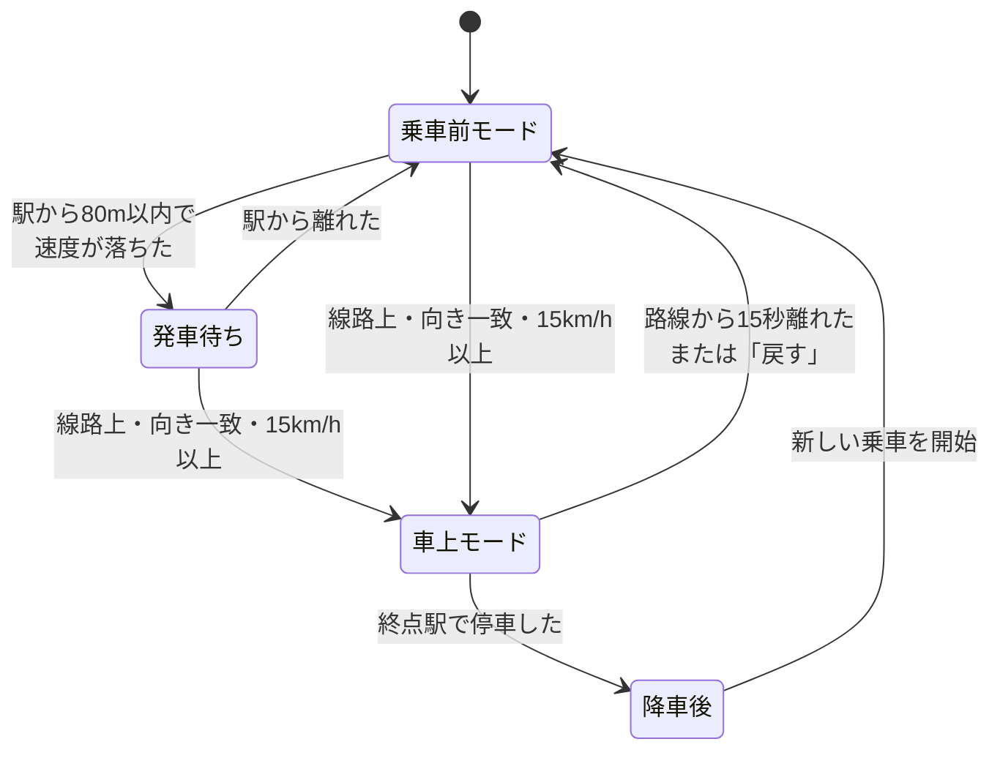
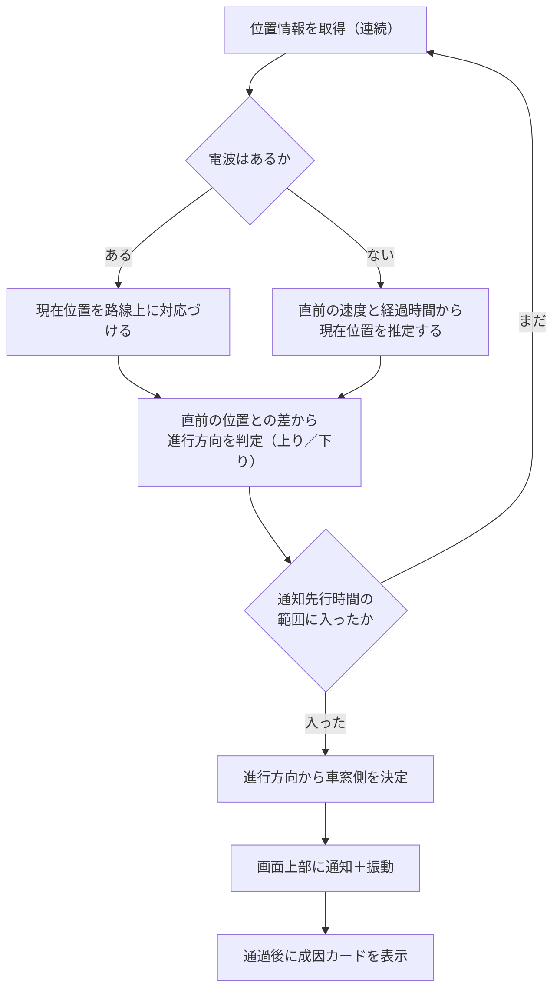
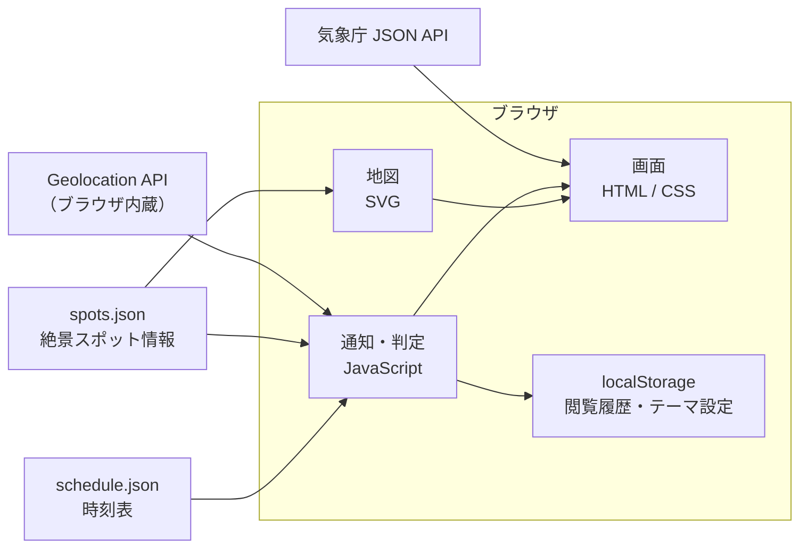

# 車窓絶景ナビ 設計書

銚子電鉄の車窓から見える絶景を、見逃さないためのウェブサイト。Geoアクティビティコンテスト応募作品。

用語の定義は [CONTEXT.md](../CONTEXT.md) を参照。今回作らないものは [将来構想.md](./将来構想.md) に分けてある。

---

## 1. 企画概要

乗客のスマートフォンに、絶景スポットの接近と、進行方向から見て左右どちらの窓かを表示する。通り過ぎたあとに、その風景ができた地理的な理由を数コマのマンガで見せる。

銚子から外川まで 19 分。窓の外を見張っていなくても見逃さない。

対象路線は銚子電鉄（銚子駅〜外川駅、全長 6.4km、10 駅）に限定する。表示言語は日本語のみ。

---

## 2. 課題と提供価値

### 課題

車窓から絶景を楽しもうとすると、次のことで困る。

**見える側がわからない。** 撮影しようと窓際で構えていたのに、実際には反対側の窓だった。同じ地点でも上りと下りで左右は逆になるため、事前に調べていても間違えやすい。

**いつ来るかわからない。** 見逃すまいと窓の外を見つめ続けるのは疲れる。気を抜くと過ぎている。

**なぜその風景なのかがわからない。** 見えたものが「きれいな畑」で終わってしまう。その畑がなぜそこに広がっているのかは、鉄道会社のサイトにも書かれていない。

### 提供価値

| 課題 | 提供するもの |
|---|---|
| 見える側がわからない | 進行方向を自動で判定し、左右どちらの窓かを通知する |
| いつ来るかわからない | 接近を先に知らせる。窓の外を見つめ続けなくてよい |
| なぜその風景なのかがわからない | 通過後に、その風景ができた地理的な理由を短いマンガで見せる |

3 つ目に力を入れる。銚子の台地は水に乏しく、稲作より畑作に向いた。だから車窓にキャベツ畑が広がる。このつながりを、その土地の味や手ざわりに置きかえて伝える。

---

## 3. 利用シナリオ

### 3.1 四つの局面

**乗車前。** 地図を開くと、路線と絶景スポットが出る。その日の天候に合う見どころに色がつく。興味のないテーマは消せる。

**発車待ち。** 駅に着くと、地図の上に発車待ちの帯が出る。次の発車時刻と、その日のおすすめの絶景、それが上り・下りそれぞれでどちら側の窓から見えるかを、乗る前に一目で確かめられる。座る側を決めてから乗れる。

**車上。** 電車が動き出すと車上モードに変わる。現在位置が地図上を進み、絶景スポットが近づくと画面上部に通知が出る。通知には残り時間と、左右どちらの窓かを書く。時刻表とずれていれば遅れも出す。

**降車後。** その日通過した絶景スポットの成因カードと、旅の記録をまとめて読める。

### 3.2 モードの自動判定

利用者に「駅に着きました」「乗りました」と申告させない。位置と速度だけで切り替える。

**発車待ちへ。** 駅の座標から半径 80m の内側に居て、歩く程度の速さまで落ちていれば発車待ちとする。半径を 80m まで広げるのは、市販の端末の位置情報が 5〜15m ずれ、駅前の建物のあいだではさらに悪くなるためで、10m ほどの円では駅に立っていても入れないことがある。駅どうしは数百 m 以上離れているので、広くしても取り違えはしない。駅前の道を通り過ぎるだけの人は、すぐ円から出るので消える。

**車上へ。** 次の三つがそろったときに切り替える。

| 条件 | 値 | なぜ |
|---|---|---|
| 線路からの距離 | 30m 以内 | 位置情報の誤差の 2 倍ほど。沿線の道路の多くはこれより離れている |
| 進行方向 | 線路の向きとおおむね一致 | 線路と並んで走る車を除くため |
| 速度 | 時速 15km 以上 | 歩く速さ（時速 10.8km）と分けるため |

**車上モードからは、停車では抜けない。** 抜けるのは次の三つのいずれか。

| 抜ける条件 | 値 |
|---|---|
| 路線から離れた | 30m の外に 15 秒続けていた |
| 終点に着いた | 終点駅の 80m 以内で、かつ停車した |
| 「戻す」を押した | — |

速度を「入るとき」だけの条件にしているのは、電車が途中駅で必ず停まるため。速度で抜ける作りにすると、銚子から外川までの 8 つの途中駅すべてで車上モードが切れ、そのたびに通知も遅れの表示も止まってしまう。乗っている人は降りるまで乗っている。降りればホームを歩いて線路から離れるので、15 秒で自然に抜ける。

切り替えるときは画面上部に短い帯を出す。操作は妨げない。判定が外れていれば「戻す」を押せばよい。



発車待ちを経ずに車上モードへ入る道も残す。位置情報を許可したのが乗ってからだった場合や、途中駅で判定を取りこぼした場合でも、通知だけは動く。

終点で降車後へ移るとき、まだ通過扱いになっていない絶景スポットがあれば、まとめて通過扱いにする。外川駅と河津桜・菜の花はどちらも 6440m 地点にあり、停車位置とスポットが重なる。2 両編成は約 36m あるので、乗っている車両と位置情報の誤差しだいで、通過を検出できないことがある。取りこぼしても旅の記録には残す。

### 3.3 通知が出るまで



**進行方向の判定。** 位置情報は「いまどこにいるか」しか教えてくれない。連続する 2 点の差から移動の向きを求め、路線の向きと照らして上りか下りかを決める。左右どちらの窓かは、この判定で決まる。

**通知を出すとき。** 「そのスポットまでの残り距離 ÷ いまの速度」が 45 秒を切ったら出す。固定の距離にしないのは、銚子電鉄が駅ごとに加減速するため。同じ 200m でも、走り出したところと駅に近づいているところでは、着くまでの時間が倍ちがう。

**電波がない場合。** 位置情報が途切れたら、途切れる直前の速度と経過時間から現在位置を推定して通知を出す。ただし 60 秒まで。それを超えたら推定をやめ、通知と遅れの表示を引っこめる。全長 6.4km を 19 分で走る路線では、1 分ぶんの誤差はもう無視できない。位置情報が戻ったら再開する。

そのため、絶景スポットの情報・地図・アイコンは乗車前にまとめてブラウザへ保存しておく。通信が切れても通知は動く。止まるのは天候の取得だけ。

---

## 4. 画面構成

画面は 5 つ。共通の白い半透明の枠組みの上に、テーマの色が透ける。ボタンの位置と操作方法は、画面が変わっても同じにする。揺れる車内で押し間違えないため。

### 4.1 地図画面（乗車前モード）

```
┌─────────────────────────────┐
│ 車窓絶景ナビ         銚子電鉄 │
├─────────────────────────────┤
│                             │
│    ／￣￣＼    ◇本銚子      │  ← 地形は色の濃淡で表す
│   ／ 台地  ＼   │           │     アイコンはテーマ色の
│  ｜  ◇笠上黒生 │           │     ひし形バッジ
│   ＼      ／  ◇観音        │
│      ￣￣    │              │
│   ▓▓▓ 海 ▓▓▓ ◇仲ノ町      │
│                             │
├─────────────────────────────┤
│ きょうは晴れ。海がよく見えます │  ← 天候による強調（自動）
├─────────────────────────────┤
│ ◆地形 ◆気候と農業 ◆産業 ◆海 │  ← テーマの絞り込み（手動）
└─────────────────────────────┘
```

最初は路線と絶景スポットのアイコンだけを出す。そこへ、その日の天候に合う見どころを足す。興味のないテーマは利用者が消せる。

天候の予報は「千葉県北東部」のような広い区分でしか手に入らない。そのため「この地点はよく見える」とは書かず、「きょうは晴れ」とだけ書く。

#### 拡大・縮小

指 2 本またはホイールで拡大、指 1 本で移動する。いちばん引いた状態が上の図（路線全体）で、そこから 16 倍まで寄れる。16 倍で、駅ひとつとその周り 300m ほどが画面いっぱいになる。関東全域のような広い範囲は出さない。この作品が答えるのは銚子電鉄の車窓についてだけで、それより広い地図は読む理由がない。

拡大しても、文字・駅の印・絶景スポットのアイコン・線路の太さは画面上の大きさを変えない。変わるのは地形の細かさと、それらの間隔だけ。寄るほど文字が大きくなる作りにすると、いちばん寄ったところで名前ひとつが画面を埋めてしまう。

絶景スポットの**名前**は、少し寄ってから出す。路線全体を見ているあいだはアイコンだけにして、地形と路線の形が読み取れる状態を保つ。

引いた状態へ戻すボタンを画面の右下に置く。乗車前モードでは位置情報を使わないので、これは「現在位置へ」ではなく「路線全体へ」戻すボタンとして働く（車上モードで本来の意味になる）。

#### 絶景スポットの下敷き

アイコンを押すと、画面の下半分にそのスポットの下敷きが出る。**これは成因カード（6 章）ではない。** 成因カードは通過後に読むもので、ここで出すのは乗車前の予習に必要なことだけ。

| 出すもの | 理由 |
|---|---|
| 名前・場所・テーマ | どれを見ているかがわかるように |
| ひとこと（`summary`） | 何が見えるのかの手がかり |
| 車窓側（上り・下りの両方） | 乗車前はどちら向きに乗るかわからないので、両方書く |
| 見ごろの季節・見える時間 | 行く日と、身構える余裕があるかの目安 |

下敷きを出すと、地図はその地点を「下敷きに隠れていない範囲のまんなか」へ寄せる。**倍率は変えない。** 利用者が決めた見え方を横取りしないため。下へはらうか、地図の何もないところを押すと閉じる。

### 4.2 地図画面（発車待ち）

```
┌─────────────────────────────┐
│ ● 銚子駅                     │
│   次の発車 14:32 外川方面      │  ← 時刻表の予定
│          15:08 外川方面      │
├─────────────────────────────┤
│                             │
│   （地図は乗車前モードと同じ）  │
│                             │
│                             │
├─────────────────────────────┤
│ この先の見どころ               │
│ ◆森のトンネル   上り左／下り右 │  ← 乗る前に座る側を決められる
│ ◆キャベツ畑     上り右／下り左 │
└─────────────────────────────┘
```

駅に着いてから乗るまでの数分は、乗客がいちばん自由に画面を見られる時間である。揺れもしないし、窓の外を気にしなくてよい。ここで「どちら側に座るか」を決めておけば、乗ってからの通知は確認になる。

**車窓側は上り・下りの両方を書く。** どちら向きに乗るかはまだ決まっていないため。乗ってしまえば進行方向が判定でき、通知は片方だけを言う。

**次の発車時刻は時刻表の予定として出す。** 実際に遅れているかどうかは、この画面では分からない。それを知るには、その列車にいま乗っている誰かの位置情報が要るが、この作品は利用者どうしをつなぐ仕組みを持たない（[将来構想 8](./将来構想.md)）。

そのため「あと 3 分」のような分単位のカウントダウンは出さない。秒が減っていく表示は、実際の運行を見ているという印象を与える。遅れていれば乗り遅れる。時刻だけを書いておけば、乗客は駅の発車標と見比べて自分で判断できる。

### 4.3 地図画面（車上モード）

```
┌─────────────────────────────┐
│ ▶ まもなく 森のトンネル       │  ← 通知帯
│   右の窓 ・ あと 30 秒        │     テーマ色で塗る
├─────────────────────────────┤
│                             │
│    ／￣￣＼    ◆本銚子      │
│   ／ 台地  ＼   ●←現在位置  │
│  ｜        ｜   │      [📷] │  ← 撮影ボタン
│   ＼      ／  ◇観音        │
│      ￣￣                   │
│                             │
├─────────────────────────────┤
│ 外川方面（下り） 約2分遅れ 3/6 │
└─────────────────────────────┘
```

地図は乗車前モードと同じものを使う。増えるのは現在位置と通知帯、進行方向、遅れの表示、それに撮影ボタンだけ。乗車前に覚えた見方がそのまま通じる。

#### 地図の動き

現在位置を画面のまんなかに保ったまま、地図のほうが流れる。指で動かすと追うのをやめ、右下のボタンを押すと現在位置へ戻って再び追いはじめる。地図アプリで見慣れた振る舞いにしておく。揺れる車内で、覚え直しをさせないため。

車上モードに入るときに一度だけ、路線全体（1 倍）から約 4 倍まで寄せる。1 倍のままだと 6.4km 全体が画面に収まっているので、現在位置の印が動くだけで、次のスポットがどちら側なのかが読み取れない。寄せるのはこの一度きりで、そのあとは利用者の操作を優先する。

#### 通知帯

| 段階 | 出るもの |
|---|---|
| 残り 45 秒を切った | 「まもなく ○○ ／ 右の窓 ・ あと 45 秒」＋ 振動 |
| そこから | 秒数を **5 秒刻み**で更新（45 → 40 → … → 15） |
| 残り **100m** を切った | 「**右側の車窓を見てください**」に変わる |
| 停車しているあいだ | 秒数を消し「まもなく ○○」だけ |
| 通過した | 帯が消える |

**秒数を 5 秒刻みにするのは、1 秒ずつ減る数字が気を散らすため。** 見てほしいのは数字ではなく窓の外で、必要なのは「まだ余裕がある／もうすぐだ」という感覚だけ。

**切り替えを距離（100m）で決めているのは、速度で決めると壊れるため。** 森のトンネルは本銚子駅と同じ 1863m 地点、河津桜・菜の花は外川駅と同じ 6440m 地点にある。電車はそこへ向かって減速して停まるので、距離と速度が同時に小さくなり、「残り距離 ÷ 速度」の答えが減らなくなる。停まれば速度は 0 になり、割り算そのものが成り立たない。距離なら、速度がいくつでも同じように効く。

**同時に二つは出さない。** 前のスポットを通過するまで、次の通知は待たせる。遠くに見える海（1496m）と森のトンネル（1863m）は 367m しか離れておらず、速い区間では二つの通知の時間が重なる。二つ並べると、揺れる車内では読みきれない。

**振動は短く 1 回**（200ms ほど）。電車自体が揺れているので、長い振動や複雑なパターンは他の揺れと区別がつかない。なお iOS の Safari は振動に対応していないため、iPhone では鳴らない。通知の帯だけで用が足りるようにしておく。

#### 遅れの表示

自分の位置情報と時刻表を照らして、いま乗っている列車が予定からどれだけずれているかを出す。他の利用者の位置は使わない。自分の端末の中だけで完結するので、通信を伴わない。

どの列車に乗っているかは、現在時刻と進行方向から時刻表を引いて自動で決める。利用者に選ばせない（3.2 と同じ考え方）。

予定どおりなら何も出さない。1 分以上ずれたときだけ「約 2 分遅れ」と書く。分より細かくは書かない。停車時間や発車の手際で数十秒は動くもので、それを秒で見せても正確になるわけではない。

**更新は 30 秒ごと。** 位置情報には常に 5〜15m の誤差があり、時速 30km なら 1〜2 秒ぶんの「遅れ」が絶えず揺れる。毎秒引き直すと、59 秒と 61 秒のあいだを行き来して表示が出たり消えたりする。

この表示は乗り継ぎのためにある。外川で折り返す時間、銚子で JR に乗り換える時間が足りるかどうかは、遅れが分かっていないと読めない。

#### 画面を眠らせない

車上モードのあいだは、画面が自動で暗くならないようにする（Screen Wake Lock）。多くの端末は 30 秒から 1 分ほど触らないと画面を消すが、この作品は「窓の外を見張らなくてよい」ことを value にしている。手を触れずに待っているあいだに画面が消えては、通知そのものが届かない。

車上モードを抜けたら解除し、ふだんのスマートフォンに戻す。

### 4.4 成因カード

絶景スポットを通過したあとに表示する。詳細は 6 章。

### 4.5 旅の記録

降車後に読める。詳細は 7 章。

---

## 5. 地図の設計

### 5.1 方針

路線・駅・絶景スポットの座標と標高には実データを使う。画面に出す絵は地図タイルではなく、ゲームの世界地図のようなイラストとして描き起こす。理由は [ADR-0001](./adr/0001-地図はタイルを使わず自作イラストとする.md) を参照。

乗客が知りたいのは、絶景スポットの位置と、この先が高いか低いか、路線全体の地勢。測量の精度はいらない。

### 5.2 地形の表現

標高データは色の濃淡に変換して背景に敷く。台地は濃く、低地は淡く、水域は青。等高線も数値も出さない。

その上に、国土地理院の**陰影起伏図**を重ねて立体感を出す。色の濃淡だけだと段彩図のように平たく見え、台地の縁がどこかが読み取りにくいため。陰影を自前で計算せず出来合いのタイルを使う理由は [ADR-0003](./adr/0003-地形の陰影は自前で計算せず国土地理院の陰影起伏図を使う.md) を参照。画像なので拡大すると必ずぼやける。約 6 倍から薄れさせ、10 倍で消す。そこから先は色分けと SVG の線だけが残る。

さらに、陸のかたちが海へ落とす影を敷いて、陸を一段高く見せる。海と陸の境目は地図の中でいちばん大きな段差なので、そこがはっきりしていると全体が立体に見える。

銚子電鉄は低地の銚子駅を出て台地に上がり、外川駅へ下る。本銚子駅の森のトンネルは台地を切り通した跡で、キャベツ畑が広がるのは台地に水が乏しいからだ。地図で起伏が読めるようにしておくと、成因カードの説明が入りやすい。

### 5.3 絶景スポットのアイコン

ひし形のバッジとして地図上に置く。中の絵はその絶景を表す（キャベツ、トンネル、波、醤油樽など）。色はテーマに従う。

### 5.4 テーマ配色

| テーマ | 地の色 | 差し色 | 淡色 | 対象 |
|---|---|---|---|---|
| 地形 | `#3F5A2E` | `#8A6F3E` | `#DCE5C8` | 切通し、台地の起伏 |
| 気候と農業 | `#6F8F36` | `#D99A2B` | `#F5EFD9` | キャベツ畑、ひまわり畑、桜 |
| 産業と水運 | `#2E4A6B` | `#B8A88A` | `#E8E4D8` | ヤマサ醤油工場 |
| 海と空 | `#2A6E8F` | `#7FC4D9` | `#E3F0F5` | 海が見える区間 |

この 4 色は地図のアイコン、通知帯、成因カード、旅の記録で共通に使う。色を見ればテーマがわかるようにしておく。

---

## 6. 成因カードの設計

### 6.1 形式

数コマを順にめくって読む。案内役のキャラクターは置かず、その土地の側から語る文体で書く。

**1 スポットあたり 400 字ほどを、5〜6 コマに分ける。** 1 コマは 60〜80 字（3〜4 行）と、画像 1 枚。画像は任意で、無いコマがあってもよい。

コマ数を増やして 1 コマを短く保つのは、揺れる車内で読むため。1 コマが画面の半分を埋めるほど長いと、指で押さえながら目で追うことになる。

### 6.2 表示するタイミング

絶景スポットを**通過したあと**に出す。接近の通知には知識を載せない。

通知を見た乗客が知りたいのは「右の窓、あと 30 秒」だけだ。そこへ解説を足すと、撮影に間に合わせることも、知識を伝えることも中途半端になる。まず風景を見て、席に落ち着いてから読む。

**通過したら自動でせり出す。** 下へはらえば閉じられるので、見たくなければすぐに退けられる。あとから読み直したくなったら、地図上のバッジを押せばまた開く。通過したバッジは見た目を変えて、読めるものだと分かるようにしておく。

乗車前モードでアイコンを押すと出る下敷き（4.1）は、これとは別のもの。あちらは「どちら側の窓を見ればいいか」を答えるための予習用で、成因カードの中身は載せない。通過したあとは、同じバッジが成因カードを開くようになる。

#### 画像の扱い

**画像は自分たちで撮る・描くものだけを使う。** 鉄道会社や他所のサイトの画像は、許諾の確認が要るうえ、応募作品は公序良俗・関係法令（著作権等）に抵触すると選考対象外になる。プレゼン動画と作品予稿はコンテストのサイトに掲載され、会場でも上映される。自分たちで撮ったものなら、そのまま展示にも動画にも使える。現地検証（[将来構想 6](./将来構想.md)）に行くとき、あわせて撮ってくる。

**画像は発車待ちのあいだにまとめて先読みする。** 6 スポット × 5〜6 コマで 30 枚ほどになり、通過するそのときに読みはじめたのでは間に合わない。駅にいるあいだは電波がある見込みが高く、発車まで数分ある。先読みが間に合わなかったコマ、通信が無いときのコマは、文だけを出す。通知そのものは画像に依存しないので、いずれにせよ動く。

### 6.3 書き方

地理の授業にはしない。地形や気候の話を、味や手ざわりに着地させる。笠上黒生駅〜西海鹿島駅のキャベツ畑で書いてみる。

> **1コマ目**（台地と海風のイラスト）
> 水はけの良い台地と、暖かな海風。
> 稲より **畑作** に向いた土地が、ここに広がっている。
>
> **2コマ目**（キャベツのイラスト）
> だからキャベツは **甘く、パリッと** 育つ。
> 一口かじれば、潮風の余韻がのこる。

「台地は水利が悪く畑作に向く」という事実は落とさず、最後を味の話にしている。覚えてもらう必要はない。なお、特定の店への誘導はしない（[将来構想 3](./将来構想.md) 参照）。

### 6.4 参考

配色とレイアウトの示意図: [成因カード モックアップ](https://claude.ai/code/artifact/21fafd6c-9ad1-41cb-b4c5-451b603d0510)

---

## 7. 旅の記録

降車後に、その日の乗車をまとめて見せる。

```
┌─────────────────────────────┐
│ きょうの旅         3月20日(木) │
├─────────────────────────────┤
│ 銚子 ─◆─◆─◇─◆─◇─ 外川      │  ① 路線のタイムライン
│      産 海 地 気 気           │     通過したスポットを
│                             │     テーマ色で並べる
├─────────────────────────────┤
│  ┌───┐ ┌───┐ ┌───┐          │  ② 撮った写真と
│  │   │ │   │ │   │          │     成因カードの抜粋
│  └───┘ └───┘ └───┘          │
├─────────────────────────────┤
│ 台地の風が、この土地の甘さを   │  ③ 体験としての結び
│ つくっていた。                │
├─────────────────────────────┤
│         [ 画像として保存 ]     │
└─────────────────────────────┘
```

**① 路線のタイムライン。** その日通過した絶景スポットをテーマ色の並びとして示す。何を見たかが一目でわかる。

**② 共有用の画像。** タイムライン、成因カードの抜粋、乗客が撮った写真を 1 枚の縦長画像にまとめ、保存できるようにする。乗客が SNS に上げれば、そのまま銚子電鉄の宣伝になる。

**③ 結びの言葉。** 「今日学んだこと」の箇条書きにはしない。その日たどったつながりを、一文の感想として書く。その日いちばん多く通ったテーマに応じた一文を選ぶ。文そのものは `spots.json` と同じく人が手で書くファイルに置き、コードには埋めない。

### 7.1 写真

車上モードの画面に撮影ボタンを置く。押すと端末のカメラがそのまま立ち上がる（アプリの中にカメラの画面を作らない）。ブラウザが描くカメラは起動が遅く、シャッターも切りにくい。ふだん使っているカメラをそのまま開くほうが、一瞬で過ぎる森のトンネルにも間に合う。

撮った写真は、撮った時刻と、そのとき直近だった絶景スポットを一緒に覚えておく。旅の記録のタイムラインに、どこで撮ったものかを並べられるようにするため。

**写真は端末の中（IndexedDB）に残す。** あとから旅の記録を見返せるようにするため。`localStorage` に入れないのは、上限が 5MB ほどしかなく、写真 1 枚を文字列にしただけで埋まってしまうため。

写真を持つことで、この作品は**個人情報を扱うことになる**（顔が写り、写真には撮影地点の情報が含まれる）。ただし送信先がない。サーバーもデータベースも持たない構成なので（[ADR-0002](./adr/0002-フレームワークとサーバーを持たない.md)）、写真は端末の外へ出しようがない。9.1 の記述もこれに合わせてある。

---

## 8. データ設計

絶景スポットの情報は `spots.json` に置き、コードから完全に分離する。内容の追加・修正にプログラミングの知識を要さない。

### 8.1 絶景スポットの項目

| 項目 | 意味 | 例 |
|---|---|---|
| `id` | 識別子 | `S03` |
| `name` | 表示名 | `森のトンネル` |
| `location` | 場所の説明 | `本銚子駅` |
| `theme` | テーマ | `地形` |
| `lat` / `lon` | 緯度・経度 | 要調査 |
| `sideUp` | 上り（銚子方面）で見える側 | `左` / `右` |
| `sideDown` | 下り（外川方面）で見える側 | `左` / `右` |
| `duration` | 景観継続時間 | `長` / `中` / `短` |
| `season` | 見ごろの季節 | `春` |
| `panels` | 成因カードのコマ | 配列（5〜6 コマ） |

`panels` の 1 コマは次の形にする。`image` は任意で、無ければ文だけのコマになる。

```json
{ "text": "水はけの良い台地と、暖かな海風。稲より畑作に向いた土地が、ここに広がっている。",
  "image": "images/S04-1.jpg" }
```

`sideUp` と `sideDown` は必ず両方持つ。同じ地点でも進行方向が逆であれば左右は反転するため、片方だけでは通知が作れない。

`duration` は現時点では通知に使わない（通知先行時間は全線一律）。景観継続時間に応じた調整は [将来構想 4](./将来構想.md) を参照。

### 8.2 絶景スポット一覧

銚子駅から外川駅への順。座標と車窓側は現地調査で確定させる。

| id | 場所 | 見えるもの | テーマ | 継続 | 車窓側 |
|---|---|---|---|---|---|
| S01 | 仲ノ町駅付近 | ヤマサ醤油工場 | 産業と水運 | 中 | 要調査 |
| S02 | 観音駅〜本銚子駅 | 遠くに見える海 | 海と空 | 長 | 要調査 |
| S03 | 本銚子駅 | 森のトンネル・桜 | 地形 | 短 | 要調査 |
| S04 | 笠上黒生駅〜西海鹿島駅 | キャベツ畑・トウモロコシ畑 | 気候と農業 | 長 | 要調査 |
| S05 | 君ヶ浜駅〜犬吠駅 | ひまわり畑 | 気候と農業 | 中 | 要調査 |
| S06 | 外川駅 | 河津桜・菜の花 | 気候と農業 | 中 | 要調査 |

各スポットの地理的な成り立ちは以下のとおり。これが成因カードの元になる。

- **S01 ヤマサ醤油工場** — 寒暖差の小さい湿潤な海洋性気候が麹菌の働きに適す。利根川東遷後の水運によって原料を集められた。同じ理由で野田も醤油の産地になった。
- **S02 海が見える区間** — 台地の上を走る区間から太平洋を望む。
- **S03 森のトンネル** — 低地から台地へ上がるための切通し。両側の樹木が覆いかぶさりトンネル状になっている。
- **S04 キャベツ畑** — 銚子は春キャベツの収穫量が日本一。温暖な海沿いの台地は水利に乏しく、稲作に向かない土地条件が畑作を選ばせた。
- **S05 ひまわり畑** — キャベツ畑の休閑期に、肥料用として植えられる。
- **S06 河津桜・菜の花** — 2019 年に銚子電鉄が植樹した桜並木。ぬれ煎餅やまずい棒と並ぶ増収策の一環。

### 8.3 路線データ

路線の形状（駅の座標と線路の折れ線）は OpenStreetMap から取得する。標高は国土地理院の標高タイルを使い、地図背景の色の濃淡に変換する。どちらも数値としては表示しない。地形の陰影は国土地理院の陰影起伏図タイルをそのまま使う（[ADR-0003](./adr/0003-地形の陰影は自前で計算せず国土地理院の陰影起伏図を使う.md)）。

| もの | 出典 | ライセンス |
|---|---|---|
| 線路・駅・工場・農地・海岸線 | © OpenStreetMap contributors | ODbL |
| 標高（地形の色分け） | 国土地理院 標高タイル（DEM5A、欠けは DEM10B で補完） | 国土地理院コンテンツ利用規約 |
| 地形の陰影 | 国土地理院 陰影起伏図タイル | 国土地理院コンテンツ利用規約 |
| 天気予報 | 気象庁 | — |
| 時刻表 | 銚子電気鉄道 公式サイト | 事実の記載として書き写す |
| 成因カードの画像 | 自分たちで撮影・作図 | 自作（6.2） |

この表記は応募書類・発表資料にも必要。取得手順は [README](../README.md) を参照。

### 8.4 時刻表データ

銚子電鉄は GTFS も API も公開していない。公式サイトの「全駅時刻表」PDF を人が読んで `schedule.json` に書き写す。`spots.json` と同じく、人が手で書くファイルとして扱う。

**曜日による区別はない。** 銚子電鉄は毎日同じダイヤで走る。下り 19 本、上り 19 本のみ。平日と土休日を分ける必要がなく、祝日の判定も要らない。

一本の列車について、通る駅すべての時刻を持たせる。

```json
{
  "改正日": "2024-03-16",
  "列車": [
    { "番号": 3, "方向": "下り",
      "時刻": { "銚子": "06:26", "仲ノ町": "06:28", "…": "…", "外川": "06:48" } }
  ]
}
```

駅ごとの発車時刻だけでなく全駅ぶんを持つのは、遅れ（4.3）を求めるのに「いまこの列車は時刻表のうえでどこに居るはずか」が要るため。前後の駅の時刻から按分すれば、区間の途中でも予定の位置が出せる。

始発の 2 本（下り 1 号・5 号）は銚子駅を通らず仲ノ町駅から出る。車庫が仲ノ町にあるため。`時刻` にその駅の項目を持たせないことで表す。銚子駅で待っている人には、この 2 本は出さない。

**ダイヤ改正のたびに手で更新する。** 更新を忘れると、発車時刻も遅れも黙って狂う。`改正日` を持たせてあるのは、画面に出すためではなく、次に開いた人がいつのダイヤかを確かめられるようにするため。手順は [README](../README.md) に残す。

---

## 9. 技術構成



### 9.1 採用するもの

| 領域 | 採用 | 理由 |
|---|---|---|
| 言語 | 素の HTML / CSS / JavaScript | ビルド工程がなく、ファイルを開けばそのまま動く |
| 地図 | SVG | イラストとアイコンを同じ座標系に置ける。拡大してもぼやけない（背景に敷く陰影だけは画像なので、寄ると薄れさせる。[ADR-0003](./adr/0003-地形の陰影は自前で計算せず国土地理院の陰影起伏図を使う.md)） |
| 位置情報 | Geolocation API | ブラウザ内蔵。サーバー不要 |
| 通知 | 画面内の帯＋振動 | 乗車中は画面を開いているので、これで足りる（Wake Lock で画面を眠らせない。4.3） |
| 撮影 | `<input type="file" capture>` | 端末のカメラをそのまま開く。アプリの中にカメラの画面を作らない（7.1） |
| 天候 | 気象庁 JSON API | 無料・登録不要。国土地理院主催のコンテストで気象庁の公式データを使う筋の良さもある |
| 保存 | localStorage ＋ IndexedDB | 設定・通過の記録は localStorage。乗客が撮った写真は容量の都合で IndexedDB（7.1） |
| 公開 | GitHub Pages または Netlify | 無料。公開 URL を応募書類に載せられる |

緯度経度から SVG 上の座標への変換は自前で行う。全長 6.4km の範囲では単純な線形変換で十分な精度が出る。

### 9.2 採用しないもの

| 見送るもの | 理由 |
|---|---|
| React などのフレームワーク | 画面数も状態も少なく、解決すべき問題が発生しない。[ADR-0002](./adr/0002-フレームワークとサーバーを持たない.md) |
| サーバー・データベース・ログイン | 利用者データをブラウザ内に置けば足りる。乗車中の人の位置を待っている人へ中継する仕組みだけはサーバーを要するが、それは見送る（[将来構想 8](./将来構想.md)） |
| Web Push 通知 | iPhone では「ホーム画面に追加」を経ないと届かない。乗車中は画面を開いているので、画面内の帯で足りる |
| 地図タイル | 情報量が多く、車内で一瞬見るには読み取れない。[ADR-0001](./adr/0001-地図はタイルを使わず自作イラストとする.md) |

### 9.3 オフラインへの備え

絶景スポットの情報、時刻表、地図、アイコンは乗車前にまとめてブラウザへ保存する。数十 KB しかないので、通信が切れても通知と遅れの表示は動く。止まるのは天候の取得だけ。

遅れを自分の位置情報だけで求めることにしたのは、これも理由のひとつになっている。他の利用者の位置に頼る作りだと、電波の切れる区間で真っ先に止まるのが遅れの表示になる。

成因カードの画像だけは別で、30 枚ほど・あわせて 1MB 前後になる。これは発車待ちのあいだに先読みする（6.2）。**通知に必要なものと、読み物に必要なものを分けてある。** 画像が間に合わなくても、通知は出るし、カードは文だけで読める。止まるのは絵だけ。
